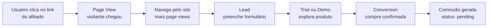

## Visão Geral

O Affiliatus.io suporta **3 tipos principais de eventos** que formam o funil completo de rastreamento de afiliados:

<CardGroup cols={3}>
  <Card title="Page View" icon="eye" color="#3b82f6">
    Rastreamento de visitas e visualizações de página
  </Card>
  
  <Card title="Lead" icon="user-plus" color="#8b5cf6">
    Captura de leads e informações de contato
  </Card>
  
  <Card title="Conversion" icon="shopping-cart" color="#22c55e">
    Vendas e conversões monetizadas
  </Card>
</CardGroup>

---

## 1. Page View (Visualização de Página)

### Descrição

O evento **`page_view`** rastreia quando um visitante acessa uma página através do link de um afiliado. Este é o primeiro ponto de contato no funil de conversão e é essencial para:

- **Medir o alcance** dos afiliados
- **Calcular taxas de conversão** (leads/visitas e vendas/visitas)
- **Identificar páginas populares** na jornada do usuário
- **Analisar padrões de navegação** dos visitantes

### Quando Usar

- Automaticamente ao carregar o SDK JavaScript com `autoPageView: true` (padrão)
- Manualmente em navegações SPA (Single Page Applications)
- Para rastrear visualizações de landing pages específicas
- Ao medir engajamento em páginas de produto/serviço

### Propriedades Suportadas

<ParamField body="url" type="string" required>
  URL completa da página visitada
  
  **Exemplo:** `https://seu-site.com/produto`
</ParamField>

<ParamField body="title" type="string">
  Título da página (`document.title`)
  
  **Exemplo:** `"Produto Premium - Sua Empresa"`
</ParamField>

<ParamField body="referrer" type="string">
  URL de origem do visitante (`document.referrer`)
  
  **Exemplo:** `"https://google.com"`
</ParamField>

<ParamField body="timestamp" type="string">
  Data/hora ISO 8601 da visualização
  
  **Exemplo:** `"2024-01-15T10:30:00Z"`
</ParamField>

<ParamField body="page" type="string">
  Identificador customizado da página
  
  **Exemplo:** `"home"`, `"pricing"`, `"checkout"`
</ParamField>

### Exemplos

<CodeGroup>

```javascript SDK JavaScript
// Automático (padrão)
const affiliatus = new Affiliatus('seu-campaign-id');
// Page view é enviado automaticamente ao carregar

// Manual
affiliatus.trackPageView({
  page: 'pricing',
  url: window.location.href,
  title: document.title
});

// Em SPA (React, Vue, etc)
router.afterEach((to, from) => {
  affiliatus.trackPageView({
    page: to.name,
    url: window.location.href
  });
});
```

```javascript API REST
fetch('https://api.affiliatus.io/events/api', {
  method: 'POST',
  headers: {
    'Content-Type': 'application/json',
    'X-API-Key': process.env.AFFILIATUS_API_KEY,
  },
  body: JSON.stringify({
    events: [{
      event_type: 'page_view',
      campaign_id: 'abc-123-def',
      affiliate_id: 'JOAO1',
      session_id: 'sess_abc123',
      properties: {
        url: 'https://seu-site.com/produto',
        title: 'Produto Premium',
        page: 'product-page'
      },
      device_info: {
        user_agent: navigator.userAgent,
        language: 'pt-BR',
        screen_width: 1920,
        screen_height: 1080
      }
    }]
  })
});
```

```php PHP
<?php
// Rastreamento server-side de page view
$data = [
    'events' => [[
        'event_type' => 'page_view',
        'campaign_id' => 'abc-123-def',
        'affiliate_id' => $_GET['ref'] ?? 'direct',
        'session_id' => session_id(),
        'properties' => [
            'url' => $_SERVER['REQUEST_URI'],
            'title' => $pageTitle,
            'referrer' => $_SERVER['HTTP_REFERER'] ?? ''
        ],
        'device_info' => [
            'user_agent' => $_SERVER['HTTP_USER_AGENT'],
            'ip' => $_SERVER['REMOTE_ADDR']
        ]
    ]]
];

$ch = curl_init('https://api.affiliatus.io/events/api');
curl_setopt($ch, CURLOPT_HTTPHEADER, [
    'Content-Type: application/json',
    'X-API-Key: ' . $_ENV['AFFILIATUS_API_KEY']
]);
curl_setopt($ch, CURLOPT_POSTFIELDS, json_encode($data));
curl_setopt($ch, CURLOPT_RETURNTRANSFER, true);
curl_exec($ch);
?>
```

</CodeGroup>

### Métricas Geradas

- **Total de visitas** por afiliado
- **Taxa de rejeição** (visitas sem lead/conversão)
- **Páginas mais visitadas**
- **Origem do tráfego** (via referrer)
- **Engajamento** (tempo entre visitas)

---

## 2. Lead (Captura de Lead)

### Descrição

O evento **`lead`** rastreia quando um visitante fornece informações de contato ou demonstra interesse qualificado no seu produto/serviço. Este evento representa o **meio do funil** e é crucial para:

- **Qualificar o tráfego** dos afiliados
- **Medir a intenção** de compra dos visitantes
- **Calcular conversão de lead para venda**
- **Nutrir leads** com informações de atribuição

### Quando Usar

- Quando o usuário preenche um formulário de interesse
- Ao cadastrar-se para trial gratuito
- Ao assinar newsletter ou baixar material
- Ao adicionar produtos ao carrinho
- Ao iniciar processo de checkout
- Ao solicitar demonstração ou contato

### Propriedades Suportadas

<ParamField body="email" type="string">
  E-mail do lead (recomendado para deduplicação)
  
  **Exemplo:** `"joao@email.com"`
</ParamField>

<ParamField body="name" type="string">
  Nome completo do lead
  
  **Exemplo:** `"João Silva"`
</ParamField>

<ParamField body="phone" type="string">
  Telefone do lead
  
  **Exemplo:** `"(11) 99999-9999"`
</ParamField>

<ParamField body="company" type="string">
  Nome da empresa (B2B)
  
  **Exemplo:** `"Tech LTDA"`
</ParamField>

<ParamField body="lead_type" type="string">
  Tipo ou categoria do lead
  
  **Exemplo:** `"trial_signup"`, `"newsletter"`, `"demo_request"`
</ParamField>

<ParamField body="url" type="string">
  URL onde o lead foi capturado
  
  **Exemplo:** `"https://seu-site.com/signup"`
</ParamField>

<ParamField body="source" type="string">
  Origem ou canal do lead
  
  **Exemplo:** `"landing_page"`, `"popup"`, `"checkout"`
</ParamField>

<ParamField body="timestamp" type="string">
  Data/hora ISO 8601 da captura
  
  **Exemplo:** `"2024-01-15T10:35:00Z"`
</ParamField>

### Exemplos

<CodeGroup>

```javascript SDK JavaScript - Form Submit
// Ao submeter formulário de cadastro
document.getElementById('signup-form').addEventListener('submit', (e) => {
  e.preventDefault();
  
  const formData = new FormData(e.target);
  
  affiliatus.trackLead({
    email: formData.get('email'),
    name: formData.get('name'),
    phone: formData.get('phone'),
    lead_type: 'trial_signup',
    source: 'hero_form'
  });
  
  // Continuar com o submit
  e.target.submit();
});
```

```javascript SDK JavaScript - Trial Start
// Ao iniciar trial gratuito
function startTrial(userData) {
  affiliatus.trackLead({
    email: userData.email,
    name: userData.name,
    company: userData.company,
    lead_type: 'trial_started',
    url: window.location.href
  });
  
  // Redirecionar para o app
  window.location.href = '/app/onboarding';
}
```

```javascript API REST - Backend Integration
// Ao processar webhook de plataforma de email
app.post('/webhook/newsletter', async (req, res) => {
  const { email, name, source } = req.body;
  
  await fetch('https://api.affiliatus.io/events/api', {
    method: 'POST',
    headers: {
      'Content-Type': 'application/json',
      'X-API-Key': process.env.AFFILIATUS_API_KEY,
    },
    body: JSON.stringify({
      events: [{
        event_type: 'lead',
        campaign_id: process.env.CAMPAIGN_ID,
        affiliate_id: req.session.affiliate_id,
        session_id: req.session.id,
        properties: {
          email,
          name,
          lead_type: 'newsletter_signup',
          source: source || 'website'
        },
        device_info: {
          user_agent: req.headers['user-agent'],
          ip: req.ip
        }
      }]
    })
  });
  
  res.json({ success: true });
});
```

```python Python - CRM Integration
import requests
from datetime import datetime

def track_lead_capture(lead_data):
    """Rastrear lead capturado no CRM"""
    
    payload = {
        'events': [{
            'event_type': 'lead',
            'campaign_id': 'abc-123-def',
            'affiliate_id': lead_data.get('affiliate_id'),
            'session_id': lead_data.get('session_id'),
            'properties': {
                'email': lead_data['email'],
                'name': lead_data['name'],
                'phone': lead_data.get('phone'),
                'company': lead_data.get('company'),
                'lead_type': 'crm_import',
                'timestamp': datetime.utcnow().isoformat()
            },
            'device_info': {
                'user_agent': lead_data.get('user_agent'),
                'ip': lead_data.get('ip_address')
            }
        }]
    }
    
    response = requests.post(
        'https://api.affiliatus.io/events/api',
        headers={
            'Content-Type': 'application/json',
            'X-API-Key': os.getenv('AFFILIATUS_API_KEY')
        },
        json=payload
    )
    
    return response.json()
```

</CodeGroup>

### Métricas Geradas

- **Total de leads** por afiliado
- **Taxa de conversão** de visita para lead
- **Qualidade do tráfego** dos afiliados
- **Leads por tipo** (trial, demo, newsletter)
- **Custo por lead** (comissões/leads)

---

## 3. Conversion (Conversão/Venda)

### Descrição

O evento **`conversion`** rastreia quando uma venda é concretizada através de um afiliado. Este é o evento **mais importante** do sistema pois:

- **Gera comissões** para os afiliados
- **Calcula o ROI** do programa de afiliados
- **Determina os pagamentos** (payouts)
- **Mede o sucesso** real dos afiliados
- **Vincula receita** à origem do tráfego

<Warning>
  Conversões devem ter `order_id` único e `order_value` obrigatório. O sistema automaticamente calcula a comissão baseado nas configurações da campanha.
</Warning>

### Quando Usar

- Quando um pagamento é confirmado (checkout concluído)
- Ao receber webhook de gateway de pagamento
- Quando uma assinatura é ativada
- Ao confirmar recebimento de pagamento
- **NUNCA** enviar antes da confirmação do pagamento

### Propriedades Obrigatórias

<ParamField body="order_id" type="string" required>
  ID único do pedido/transação (usado para idempotência)
  
  **Exemplo:** `"ORDER-12345"`
  
  <Warning>Conversões com mesmo `order_id` serão ignoradas (deduplicação automática)</Warning>
</ParamField>

<ParamField body="order_value" type="number" required>
  Valor total da venda em reais (deve ser positivo)
  
  **Exemplo:** `99.90`
  
  <Info>A comissão será calculada automaticamente: percentage → `(order_value * commission_value / 100)` | fixed → `commission_value`</Info>
</ParamField>

### Propriedades Opcionais

<ParamField body="product" type="string">
  Nome do produto ou plano vendido
  
  **Exemplo:** `"Plano Premium Anual"`
</ParamField>

<ParamField body="customer_email" type="string">
  E-mail do cliente que comprou
  
  **Exemplo:** `"cliente@email.com"`
</ParamField>

<ParamField body="customer_name" type="string">
  Nome do cliente que comprou
  
  **Exemplo:** `"Maria Santos"`
</ParamField>

<ParamField body="customer_id" type="string">
  ID do cliente no seu sistema
  
  **Exemplo:** `"user_abc123"`
</ParamField>

<ParamField body="payment_method" type="string">
  Método de pagamento usado
  
  **Exemplo:** `"credit_card"`, `"boleto"`, `"pix"`
</ParamField>

<ParamField body="subscription_id" type="string">
  ID da assinatura (para modelos recorrentes)
  
  **Exemplo:** `"sub_abc123"`
</ParamField>

<ParamField body="url" type="string">
  URL da página de checkout/confirmação
  
  **Exemplo:** `"https://seu-site.com/checkout/success"`
</ParamField>

<ParamField body="timestamp" type="string">
  Data/hora ISO 8601 da conversão
  
  **Exemplo:** `"2024-01-15T10:45:00Z"`
</ParamField>

### Exemplos

<CodeGroup>

```javascript SDK JavaScript - Página de Sucesso
// Na página de confirmação de compra (após pagamento aprovado)
<!DOCTYPE html>
<html>
<head>
  <title>Compra Confirmada!</title>
  <script src="https://cdn.affiliatus.io/latest/affiliatus.min.js"></script>
</head>
<body>
  <h1>Obrigado pela sua compra!</h1>
  
  <script>
    const affiliatus = new Affiliatus('seu-campaign-id');
    
    // Dados do pedido (vindo do backend)
    const orderData = {
      order_id: '<?= $order->id ?>',
      order_value: <?= $order->total ?>,
      product: '<?= $order->product_name ?>',
      customer_email: '<?= $customer->email ?>',
      customer_name: '<?= $customer->name ?>'
    };
    
    // Rastrear conversão
    affiliatus.trackConversion(orderData);
  </script>
</body>
</html>
```

```javascript API REST - Webhook Stripe
// Processar webhook do Stripe
const stripe = require('stripe')(process.env.STRIPE_SECRET_KEY);

app.post('/webhook/stripe', async (req, res) => {
  const sig = req.headers['stripe-signature'];
  const event = stripe.webhooks.constructEvent(req.body, sig, process.env.STRIPE_WEBHOOK_SECRET);
  
  if (event.type === 'checkout.session.completed') {
    const session = event.data.object;
    
    // Buscar affiliate_id armazenado nos metadata
    const affiliateId = session.metadata.affiliate_id;
    const sessionId = session.metadata.session_id;
    
    if (affiliateId) {
      await fetch('https://api.affiliatus.io/events/api', {
        method: 'POST',
        headers: {
          'Content-Type': 'application/json',
          'X-API-Key': process.env.AFFILIATUS_API_KEY,
        },
        body: JSON.stringify({
          events: [{
            event_type: 'conversion',
            campaign_id: process.env.CAMPAIGN_ID,
            affiliate_id: affiliateId,
            session_id: sessionId,
            properties: {
              order_id: session.id,
              order_value: session.amount_total / 100, // Stripe usa centavos
              product: session.metadata.product_name,
              customer_email: session.customer_email,
              payment_method: 'stripe',
              subscription_id: session.subscription,
              url: session.success_url
            },
            device_info: {
              ip: req.ip,
              user_agent: req.headers['user-agent']
            }
          }]
        })
      });
    }
  }
  
  res.json({ received: true });
});
```

```python Python - Webhook Mercado Pago
from flask import Flask, request
import requests
import os

app = Flask(__name__)

@app.route('/webhook/mercadopago', methods=['POST'])
def mercadopago_webhook():
    """Processar notificação de pagamento aprovado"""
    
    data = request.json
    
    if data['type'] == 'payment' and data['action'] == 'payment.approved':
        payment_id = data['data']['id']
        
        # Buscar detalhes do pagamento
        payment = get_mercadopago_payment(payment_id)
        
        # Buscar affiliate_id armazenado nos metadata
        affiliate_id = payment['metadata'].get('affiliate_id')
        session_id = payment['metadata'].get('session_id')
        
        if affiliate_id:
            # Enviar conversão para Affiliatus
            payload = {
                'events': [{
                    'event_type': 'conversion',
                    'campaign_id': os.getenv('CAMPAIGN_ID'),
                    'affiliate_id': affiliate_id,
                    'session_id': session_id,
                    'properties': {
                        'order_id': payment['external_reference'],
                        'order_value': float(payment['transaction_amount']),
                        'product': payment['description'],
                        'customer_email': payment['payer']['email'],
                        'customer_name': payment['payer']['name'],
                        'payment_method': 'mercadopago',
                        'timestamp': payment['date_approved']
                    },
                    'device_info': {
                        'ip': request.remote_addr
                    }
                }]
            }
            
            requests.post(
                'https://api.affiliatus.io/events/api',
                headers={
                    'Content-Type': 'application/json',
                    'X-API-Key': os.getenv('AFFILIATUS_API_KEY')
                },
                json=payload
            )
    
    return {'status': 'ok'}
```

```php PHP - Integração PagSeguro
<?php
// Webhook PagSeguro
if ($_POST['notificationCode']) {
    $notificationCode = $_POST['notificationCode'];
    
    // Consultar transação no PagSeguro
    $transaction = consultarTransacaoPagSeguro($notificationCode);
    
    // Verificar se foi aprovado
    if ($transaction['status'] == 3) { // 3 = Paga
        
        // Buscar affiliate_id armazenado na referência
        $affiliateId = $transaction['reference_affiliate'];
        $sessionId = $transaction['reference_session'];
        
        if ($affiliateId) {
            // Preparar dados para Affiliatus
            $data = [
                'events' => [[
                    'event_type' => 'conversion',
                    'campaign_id' => $_ENV['CAMPAIGN_ID'],
                    'affiliate_id' => $affiliateId,
                    'session_id' => $sessionId,
                    'properties' => [
                        'order_id' => $transaction['reference'],
                        'order_value' => floatval($transaction['grossAmount']),
                        'product' => $transaction['items'][0]['description'],
                        'customer_email' => $transaction['sender']['email'],
                        'customer_name' => $transaction['sender']['name'],
                        'payment_method' => 'pagseguro'
                    ],
                    'device_info' => [
                        'ip' => $_SERVER['REMOTE_ADDR']
                    ]
                ]]
            ];
            
            // Enviar para Affiliatus
            $ch = curl_init('https://api.affiliatus.io/events/api');
            curl_setopt($ch, CURLOPT_HTTPHEADER, [
                'Content-Type: application/json',
                'X-API-Key: ' . $_ENV['AFFILIATUS_API_KEY']
            ]);
            curl_setopt($ch, CURLOPT_POSTFIELDS, json_encode($data));
            curl_setopt($ch, CURLOPT_RETURNTRANSFER, true);
            curl_exec($ch);
        }
    }
}
?>
```

</CodeGroup>

### Fluxo de Processamento

Quando uma conversão é recebida, o sistema executa:

1. **Validação** - Verifica se campaign, affiliate e domain são válidos
2. **Idempotência** - Checa se `order_id` já existe (evita duplicatas)
3. **Limites** - Verifica se o plano suporta mais conversões
4. **Salvar Evento** - Registra na tabela `events`
5. **Criar Conversão** - Cria registro na tabela `conversions` com status `pending`
6. **Calcular Comissão** - Calcula baseado em `commission_type` e `commission_value`

### Cálculo de Comissão

O sistema calcula automaticamente a comissão baseado no tipo configurado na campanha:

**Comissão Percentual** (`percentage`)
```
commission_value = (order_value * campaign.commission_value) / 100
```
Exemplo: `order_value: 100.00` + `campaign.commission_value: 10` = **R$ 10,00** de comissão

**Comissão Fixa** (`fixed`)
```
commission_value = campaign.commission_value
```
Exemplo: `order_value: 100.00` + `campaign.commission_value: 15` = **R$ 15,00** de comissão (independente do valor)

### Status da Conversão

Após criação, a conversão passa por status:

- **`pending`** - Aguardando aprovação do merchant
- **`approved`** - Aprovada e comissão confirmada
- **`rejected`** - Recusada (chargeback, fraude, etc)
- **`paid`** - Comissão paga ao afiliado

### Métricas Geradas

- **Total de conversões** por afiliado
- **Receita gerada** por afiliado
- **Comissões a pagar**
- **Taxa de conversão** (conversões/visitas)
- **Ticket médio** por afiliado
- **ROI do programa** de afiliados

---

## Comparação dos Tipos

<table>
  <thead>
    <tr>
      <th>Característica</th>
      <th>Page View</th>
      <th>Lead</th>
      <th>Conversion</th>
    </tr>
  </thead>
  <tbody>
    <tr>
      <td><strong>Objetivo</strong></td>
      <td>Rastrear visitas</td>
      <td>Capturar interesse</td>
      <td>Confirmar venda</td>
    </tr>
    <tr>
      <td><strong>Quando ocorre</strong></td>
      <td>Ao carregar página</td>
      <td>Ao preencher formulário</td>
      <td>Ao confirmar pagamento</td>
    </tr>
    <tr>
      <td><strong>Dados obrigatórios</strong></td>
      <td>URL</td>
      <td>Nenhum específico</td>
      <td>order_id + order_value</td>
    </tr>
    <tr>
      <td><strong>Gera comissão</strong></td>
      <td>❌ Não</td>
      <td>❌ Não</td>
      <td>✅ Sim</td>
    </tr>
    <tr>
      <td><strong>Limites de plano</strong></td>
      <td>❌ Não</td>
      <td>❌ Não</td>
      <td>✅ Sim</td>
    </tr>
    <tr>
      <td><strong>Requer aprovação</strong></td>
      <td>❌ Não</td>
      <td>❌ Não</td>
      <td>✅ Sim (pending)</td>
    </tr>
    <tr>
      <td><strong>Deduplicação</strong></td>
      <td>❌ Não</td>
      <td>❌ Não</td>
      <td>✅ Sim (por order_id)</td>
    </tr>
    <tr>
      <td><strong>Volume esperado</strong></td>
      <td>Alto</td>
      <td>Médio</td>
      <td>Baixo</td>
    </tr>
  </tbody>
</table>

---

## Funil Completo de Rastreamento

Exemplo de jornada completa do usuário:



### Exemplo Prático

```javascript
// 1. Usuário clica no link: https://seu-site.com?ref=JOAO1

// 2. SDK rastreia page view automaticamente
affiliatus.trackPageView({
  page: 'home',
  url: 'https://seu-site.com'
});

// 3. Usuário navega para pricing
affiliatus.trackPageView({
  page: 'pricing',
  url: 'https://seu-site.com/pricing'
});

// 4. Usuário preenche formulário de trial
affiliatus.trackLead({
  email: 'usuario@email.com',
  name: 'Novo Usuário',
  lead_type: 'trial_signup'
});

// 5. Após 7 dias, usuário decide comprar

// 6. Webhook do Stripe confirma pagamento
// Backend envia conversão via API
fetch('https://api.affiliatus.io/events/api', {
  // ... conversão com order_id e order_value
});

// 7. Afiliado JOAO1 recebe comissão pendente
// 8. Merchant aprova no dashboard
// 9. Comissão entra no próximo payout
```

---

## Boas Práticas

### Page View

<AccordionGroup>
  <Accordion title="Evite page views duplicados em SPAs">
    Em React/Vue/Angular, desative `autoPageView` e rastreie manualmente nas transições de rota para evitar duplicatas.
  </Accordion>
  
  <Accordion title="Inclua informações de contexto">
    Adicione propriedades como `page`, `section`, `category` para análises mais ricas.
  </Accordion>
  
  <Accordion title="Rastreie páginas importantes">
    Foque em páginas que indicam intenção: pricing, features, demo, não todas as páginas.
  </Accordion>
</AccordionGroup>

### Lead

<AccordionGroup>
  <Accordion title="Rastreie apenas leads qualificados">
    Não rastreie todos os formulários. Foque em ações que indicam real interesse (trial, demo, contato comercial).
  </Accordion>
  
  <Accordion title="Use lead_type para categorizar">
    Diferencie tipos de leads para análises mais precisas: `trial`, `demo`, `newsletter`, `ebook_download`.
  </Accordion>
  
  <Accordion title="Inclua o máximo de dados possível">
    Envie email, nome, telefone quando disponível. Ajuda na análise e deduplicação futura.
  </Accordion>
</AccordionGroup>

### Conversion

<AccordionGroup>
  <Accordion title="SEMPRE use order_id único">
    Use o ID da transação do seu sistema ou gateway. Nunca gere IDs aleatórios ou reutilize.
  </Accordion>
  
  <Accordion title="Envie apenas após confirmação">
    Aguarde webhook/confirmação do gateway. Nunca envie no clique do botão de compra.
  </Accordion>
  
  <Accordion title="Use order_value correto">
    Envie o valor que o cliente realmente pagou (após descontos, mas antes de taxas).
  </Accordion>
  
  <Accordion title="Teste em ambiente sandbox">
    Use webhooks de teste dos gateways e uma campanha de testes antes de ir para produção.
  </Accordion>
  
  <Accordion title="Implemente retry com idempotência">
    Se falhar, pode tentar novamente. O sistema ignora duplicatas pelo order_id.
  </Accordion>
</AccordionGroup>

---

## Troubleshooting

### Eventos não aparecem no dashboard

<Steps>
  <Step title="Verifique se a campanha está ativa">
    Status deve ser `active`, não `draft` ou `paused`
  </Step>
  
  <Step title="Confirme se o affiliate_id existe">
    O código de referência deve estar cadastrado e com status `active`
  </Step>
  
  <Step title="Valide o domain">
    O domínio de origem deve estar na lista de domínios permitidos da campanha
  </Step>
  
  <Step title="Cheque os logs de erro">
    Abra DevTools (F12) → Console para ver erros do SDK
  </Step>
</Steps>

### Conversões não geram comissão

<Steps>
  <Step title="Verifique se order_value é positivo">
    Valor deve ser maior que zero
  </Step>
  
  <Step title="Confirme se não é duplicata">
    Cheque se o `order_id` já foi usado anteriormente
  </Step>
  
  <Step title="Valide limites do plano">
    Veja se não atingiu o limite mensal de conversões do seu plano
  </Step>
  
  <Step title="Aprove manualmente no dashboard">
    Conversões ficam `pending` até aprovação manual
  </Step>
</Steps>

---

## Próximos Passos

<CardGroup cols={2}>
  <Card title="Enviar Eventos" icon="paper-plane" href="/api-reference/events/send-events">
    Veja como enviar eventos via API
  </Card>
  
  <Card title="SDK JavaScript" icon="code" href="/integrations/sdk-javascript">
    Integre o SDK no frontend
  </Card>
  
  <Card title="Integração Stripe" icon="credit-card" href="/integrations/stripe">
    Rastreie conversões do Stripe
  </Card>
  
  <Card title="Dashboard" icon="chart-line" href="https://app.affiliatus.io">
    Visualize eventos em tempo real
  </Card>
</CardGroup>

