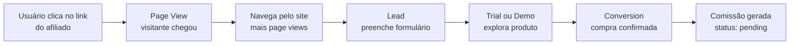

## Visão Geral

O Affiliatus.io suporta **3 tipos principais de eventos** que formam o funil completo de rastreamento de afiliados:

<CardGroup cols={3}>
  <Card
    title="Page View"
    icon="eye"
    color="#3b82f6"
    href="/guides/event-page-view"
  >
    Rastreamento de visitas e visualizações de página
  </Card>

{" "}
<Card title="Lead" icon="user-plus" color="#8b5cf6" href="/guides/event-lead">
  Captura de leads e informações de contato
</Card>

  <Card
    title="Conversion"
    icon="shopping-cart"
    color="#22c55e"
    href="/guides/event-conversion"
  >
    Vendas e conversões monetizadas
  </Card>
</CardGroup>

---

## Comparação dos Tipos

<table>
  <thead>
    <tr>
      <th>Característica</th>
      <th>Page View</th>
      <th>Lead</th>
      <th>Conversion</th>
    </tr>
  </thead>
  <tbody>
    <tr>
      <td>
        <strong>Objetivo</strong>
      </td>
      <td>Rastrear visitas</td>
      <td>Capturar interesse</td>
      <td>Confirmar venda</td>
    </tr>
    <tr>
      <td>
        <strong>Quando ocorre</strong>
      </td>
      <td>Ao carregar página</td>
      <td>Ao preencher formulário</td>
      <td>Ao confirmar pagamento</td>
    </tr>
    <tr>
      <td>
        <strong>Dados obrigatórios</strong>
      </td>
      <td>URL</td>
      <td>Nenhum específico</td>
      <td>order_id + order_value</td>
    </tr>
    <tr>
      <td>
        <strong>Gera comissão</strong>
      </td>
      <td>❌ Não</td>
      <td>❌ Não</td>
      <td>✅ Sim</td>
    </tr>
    <tr>
      <td>
        <strong>Limites de plano</strong>
      </td>
      <td>❌ Não</td>
      <td>❌ Não</td>
      <td>✅ Sim</td>
    </tr>
    <tr>
      <td>
        <strong>Requer aprovação</strong>
      </td>
      <td>❌ Não</td>
      <td>❌ Não</td>
      <td>✅ Sim (pending)</td>
    </tr>
    <tr>
      <td>
        <strong>Deduplicação</strong>
      </td>
      <td>❌ Não</td>
      <td>❌ Não</td>
      <td>✅ Sim (por order_id)</td>
    </tr>
    <tr>
      <td>
        <strong>Volume esperado</strong>
      </td>
      <td>Alto</td>
      <td>Médio</td>
      <td>Baixo</td>
    </tr>
  </tbody>
</table>

---

## Funil Completo de Rastreamento

Exemplo de jornada completa do usuário:



### Exemplo Prático de Jornada

```javascript
// 1. Usuário clica no link: https://seu-site.com?ref=JOAO1

// 2. SDK rastreia page view automaticamente
affiliatus.trackPageView({
  page: "home",
  url: "https://seu-site.com",
});

// 3. Usuário navega para pricing
affiliatus.trackPageView({
  page: "pricing",
  url: "https://seu-site.com/pricing",
});

// 4. Usuário preenche formulário de trial
affiliatus.trackLead({
  email: "usuario@email.com",
  name: "Novo Usuário",
  lead_type: "trial_signup",
});

// 5. Após 7 dias, usuário decide comprar

// 6. Webhook do Stripe confirma pagamento
// Backend envia conversão via API
fetch("https://api.affiliatus.io/events/api", {
  method: "POST",
  headers: {
    "Content-Type": "application/json",
    "X-API-Key": process.env.AFFILIATUS_API_KEY,
  },
  body: JSON.stringify({
    events: [
      {
        event_type: "conversion",
        campaign_id: "abc-123-def",
        affiliate_id: "JOAO1",
        session_id: "sess_abc123",
        properties: {
          order_id: "ORDER-12345",
          order_value: 99.9,
        },
        device_info: {
          user_agent: req.headers["user-agent"],
        },
      },
    ],
  }),
});

// 7. Afiliado JOAO1 recebe comissão pendente
// 8. Merchant aprova no dashboard
// 9. Comissão entra no próximo payout
```

---

## Quando Usar Cada Tipo

### Use **Page View** quando:

- O visitante acessa uma página via link de afiliado
- Você precisa medir o alcance dos afiliados
- Quer calcular taxas de conversão
- Deseja identificar páginas populares

### Use **Lead** quando:

- O visitante preenche um formulário de interesse
- Usuário inicia trial gratuito
- Alguém assina newsletter ou baixa material
- Quer qualificar o tráfego dos afiliados

### Use **Conversion** quando:

- Um pagamento é confirmado
- Você recebe webhook de gateway de pagamento
- Uma assinatura é ativada
- **APENAS** após confirmação de pagamento

---

## Próximos Passos

<CardGroup cols={2}>
  <Card title="Page View" icon="eye" href="/guides/event-page-view">
    Aprenda sobre o evento Page View
  </Card>

{" "}
<Card title="Lead" icon="user-plus" href="/guides/event-lead">
  Aprenda sobre o evento Lead
</Card>

{" "}
<Card title="Conversion" icon="shopping-cart" href="/guides/event-conversion">
  Aprenda sobre o evento Conversion
</Card>

  <Card
    title="Enviar Eventos"
    icon="paper-plane"
    href="/api-reference/events/send-events"
  >
    Veja como enviar eventos via API
  </Card>
</CardGroup>
