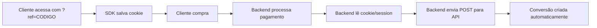

## Visão Geral

A integração via API REST permite que você envie conversões diretamente do seu backend usando API keys. Perfeito para integrações server-side com gateways não suportados.

<Warning>
  **Pré-requisito:** A [SDK JavaScript](/integrations/sdk-javascript) deve estar
  instalada no seu site! Ela é responsável por salvar o cookie com o código do
  afiliado. Esta integração API REST é **complementar** à SDK.
</Warning>

**Quando usar:**

- Você processa conversões no backend
- Usa gateway não suportado (Mercado Pago, PagSeguro, Asaas)
- Quer integração server-to-server
- Já tem a SDK instalada

---

## Como Funciona



1. **SDK salva cookie:** Cliente acessa com `?ref=CODIGO`, SDK salva no cookie
2. Cliente finaliza compra no seu sistema
3. Seu backend processa o pagamento
4. **Backend lê o código do afiliado** (do cookie ou session)
5. **Backend envia conversão via API REST**
6. API valida e cria a conversão ✨

<Note>
  **Papel da SDK:** Ela salva o código do afiliado em um cookie que dura 30
  dias. Seu backend deve ler esse cookie antes de enviar a conversão via API.
</Note>

---

## Configuração

### Passo 1: Crie uma API Key

1. No dashboard, vá em **"Configurações"** → **"API Keys"**
2. Clique em **"Nova API Key"**
3. Dê um nome descritivo (ex: "Servidor de Produção")
4. **Copie a chave imediatamente** - ela só será exibida uma vez!

<Warning>
  A API key é exibida apenas uma vez por segurança. Guarde em um local seguro
  (ex: variáveis de ambiente, gerenciador de secrets).
</Warning>

---

### Passo 2: Armazene com Segurança

**Nunca** exponha sua API key no frontend ou em repositórios públicos.

**Boas práticas:**

```bash
# .env (adicione ao .gitignore)
AFFILIATUS_API_KEY=your_api_key_here
AFFILIATUS_API_URL=https://api.affiliatus.io
```

---

## Endpoint da API

### URL Base

```
https://api.affiliatus.io/events/api
```

### Autenticação

Envie a API key no header `X-API-Key`:

```http
POST https://api.affiliatus.io/events/api
Content-Type: application/json
X-API-Key: your_api_key_here
```

---

## Enviar Conversão

### Payload Mínimo

```json
{
  "events": [
    {
      "event_type": "conversion",
      "campaign_id": "abc-123-def",
      "affiliate_id": "CODIGO_DO_AFILIADO",
      "properties": {
        "order_id": "PEDIDO-12345",
        "order_value": 99.9
      }
    }
  ]
}
```

### Payload Completo

```json
{
  "batch": true,
  "events": [
    {
      "event_type": "conversion",
      "campaign_id": "abc-123-def",
      "affiliate_id": "JOAO1",
      "properties": {
        "url": "https://seusite.com/checkout",
        "order_id": "ORDER-789",
        "order_value": 199.99,
        "product": "Plano Premium",
        "customer_email": "cliente@email.com",
        "customer_name": "João Silva",
        "timestamp": "2024-01-15T10:30:00Z"
      },
      "device_info": {
        "user_agent": "Mozilla/5.0...",
        "ip": "192.168.1.1",
        "language": "pt-BR",
        "screen_width": 1920,
        "screen_height": 1080
      }
    }
  ]
}
```

---

## Parâmetros

### Event Object

| Campo          | Tipo   | Obrigatório | Descrição                       |
| -------------- | ------ | ----------- | ------------------------------- |
| `event_type`   | String | ✅ Sim      | Sempre `"conversion"`           |
| `campaign_id`  | String | ✅ Sim      | ID público da sua campanha      |
| `affiliate_id` | String | ✅ Sim      | Código do afiliado (referralId) |
| `properties`   | Object | ✅ Sim      | Dados da conversão              |
| `device_info`  | Object | Recomendado | Informações do dispositivo      |

### Properties Object

| Campo            | Tipo   | Obrigatório | Descrição                 |
| ---------------- | ------ | ----------- | ------------------------- |
| `order_id`       | String | ✅ Sim      | ID único do pedido        |
| `order_value`    | Number | ✅ Sim      | Valor da venda em reais   |
| `url`            | String | Recomendado | URL da página de checkout |
| `product`        | String | Opcional    | Nome do produto/plano     |
| `customer_email` | String | Opcional    | E-mail do cliente         |
| `customer_name`  | String | Opcional    | Nome do cliente           |
| `timestamp`      | String | Opcional    | ISO 8601 timestamp        |

### Device Info Object

| Campo           | Tipo   | Descrição               |
| --------------- | ------ | ----------------------- |
| `user_agent`    | String | User agent do navegador |
| `ip`            | String | IP do cliente           |
| `language`      | String | Idioma do navegador     |
| `screen_width`  | Number | Largura da tela         |
| `screen_height` | Number | Altura da tela          |

---

## Exemplos de Implementação

### Node.js (Fetch)

```javascript
const AFFILIATUS_API_KEY = process.env.AFFILIATUS_API_KEY;
const AFFILIATUS_API_URL = "https://api.affiliatus.io/events/api";

async function sendConversion(orderId, orderValue, affiliateCode) {
  try {
    const response = await fetch(AFFILIATUS_API_URL, {
      method: "POST",
      headers: {
        "Content-Type": "application/json",
        "X-API-Key": AFFILIATUS_API_KEY,
      },
      body: JSON.stringify({
        events: [
          {
            event_type: "conversion",
            campaign_id: "abc-123-def",
            affiliate_id: affiliateCode,
            properties: {
              order_id: orderId,
              order_value: orderValue,
              url: "https://seusite.com/checkout",
              timestamp: new Date().toISOString(),
            },
          },
        ],
      }),
    });

    if (!response.ok) {
      throw new Error(`HTTP ${response.status}: ${await response.text()}`);
    }

    const data = await response.json();
    console.log("Conversão enviada:", data);
    return data;
  } catch (error) {
    console.error("Erro ao enviar conversão:", error);
    throw error;
  }
}

// Uso
await sendConversion("ORDER-123", 99.9, "JOAO1");
```

---

### Node.js (Axios)

```javascript
const axios = require("axios");

const affiliatusClient = axios.create({
  baseURL: "https://api.affiliatus.io",
  headers: {
    "Content-Type": "application/json",
    "X-API-Key": process.env.AFFILIATUS_API_KEY,
  },
});

async function sendConversion(orderId, orderValue, affiliateCode) {
  try {
    const response = await affiliatusClient.post("/events/api", {
      events: [
        {
          event_type: "conversion",
          campaign_id: "abc-123-def",
          affiliate_id: affiliateCode,
          properties: {
            order_id: orderId,
            order_value: orderValue,
            timestamp: new Date().toISOString(),
          },
        },
      ],
    });

    console.log("Conversão enviada:", response.data);
    return response.data;
  } catch (error) {
    console.error("Erro:", error.response?.data || error.message);
    throw error;
  }
}
```

---

### PHP (cURL)

```php
<?php

function sendConversion($orderId, $orderValue, $affiliateCode) {
    $apiKey = getenv('AFFILIATUS_API_KEY');
    $apiUrl = 'https://api.affiliatus.io/events/api';

    $payload = json_encode([
        'events' => [
            [
                'event_type' => 'conversion',
                'campaign_id' => 'abc-123-def',
                'affiliate_id' => $affiliateCode,
                'properties' => [
                    'order_id' => $orderId,
                    'order_value' => $orderValue,
                    'url' => 'https://seusite.com/checkout',
                    'timestamp' => date('c'), // ISO 8601
                ],
            ],
        ],
    ]);

    $ch = curl_init($apiUrl);
    curl_setopt($ch, CURLOPT_RETURNTRANSFER, true);
    curl_setopt($ch, CURLOPT_POST, true);
    curl_setopt($ch, CURLOPT_POSTFIELDS, $payload);
    curl_setopt($ch, CURLOPT_HTTPHEADER, [
        'Content-Type: application/json',
        'X-API-Key: ' . $apiKey,
    ]);

    $response = curl_exec($ch);
    $httpCode = curl_getinfo($ch, CURLINFO_HTTP_CODE);
    curl_close($ch);

    if ($httpCode !== 200) {
        throw new Exception("HTTP Error: $httpCode - $response");
    }

    return json_decode($response, true);
}

// Uso
try {
    $result = sendConversion('ORDER-123', 99.90, 'JOAO1');
    echo "Conversão enviada: " . print_r($result, true);
} catch (Exception $e) {
    echo "Erro: " . $e->getMessage();
}
```

---

### Python (Requests)

```python
import os
import requests
from datetime import datetime

AFFILIATUS_API_KEY = os.getenv('AFFILIATUS_API_KEY')
AFFILIATUS_API_URL = 'https://api.affiliatus.io/events/api'

def send_conversion(order_id, order_value, affiliate_code):
    headers = {
        'Content-Type': 'application/json',
        'X-API-Key': AFFILIATUS_API_KEY,
    }

    payload = {
        'events': [
            {
                'event_type': 'conversion',
                'campaign_id': 'abc-123-def',
                'affiliate_id': affiliate_code,
                'properties': {
                    'order_id': order_id,
                    'order_value': order_value,
                    'url': 'https://seusite.com/checkout',
                    'timestamp': datetime.utcnow().isoformat() + 'Z',
                },
            },
        ],
    }

    try:
        response = requests.post(AFFILIATUS_API_URL, json=payload, headers=headers)
        response.raise_for_status()
        print('Conversão enviada:', response.json())
        return response.json()
    except requests.exceptions.RequestException as e:
        print(f'Erro ao enviar conversão: {e}')
        raise

# Uso
send_conversion('ORDER-123', 99.90, 'JOAO1')
```

---

### Ruby (Net::HTTP)

```ruby
require 'net/http'
require 'json'
require 'uri'

AFFILIATUS_API_KEY = ENV['AFFILIATUS_API_KEY']
AFFILIATUS_API_URL = 'https://api.affiliatus.io/events/api'

def send_conversion(order_id, order_value, affiliate_code)
  uri = URI.parse(AFFILIATUS_API_URL)

  payload = {
    events: [
      {
        event_type: 'conversion',
        campaign_id: 'abc-123-def',
        affiliate_id: affiliate_code,
        properties: {
          order_id: order_id,
          order_value: order_value,
          url: 'https://seusite.com/checkout',
          timestamp: Time.now.utc.iso8601
        }
      }
    ]
  }

  http = Net::HTTP.new(uri.host, uri.port)
  http.use_ssl = true

  request = Net::HTTP::Post.new(uri.path)
  request['Content-Type'] = 'application/json'
  request['X-API-Key'] = AFFILIATUS_API_KEY
  request.body = payload.to_json

  response = http.request(request)

  if response.code.to_i == 200
    puts "Conversão enviada: #{response.body}"
    JSON.parse(response.body)
  else
    raise "HTTP Error: #{response.code} - #{response.body}"
  end
end

# Uso
send_conversion('ORDER-123', 99.90, 'JOAO1')
```

---

### Go

```go
package main

import (
    "bytes"
    "encoding/json"
    "fmt"
    "net/http"
    "os"
    "time"
)

type Event struct {
    EventType   string      `json:"event_type"`
    CampaignID  string      `json:"campaign_id"`
    AffiliateID string      `json:"affiliate_id"`
    Properties  Properties  `json:"properties"`
}

type Properties struct {
    OrderID    string  `json:"order_id"`
    OrderValue float64 `json:"order_value"`
    URL        string  `json:"url"`
    Timestamp  string  `json:"timestamp"`
}

type Payload struct {
    Events []Event `json:"events"`
}

func sendConversion(orderID string, orderValue float64, affiliateCode string) error {
    apiKey := os.Getenv("AFFILIATUS_API_KEY")
    apiURL := "https://api.affiliatus.io/events/api"

    payload := Payload{
        Events: []Event{
            {
                EventType:   "conversion",
                CampaignID:  "abc-123-def",
                AffiliateID: affiliateCode,
                Properties: Properties{
                    OrderID:    orderID,
                    OrderValue: orderValue,
                    URL:        "https://seusite.com/checkout",
                    Timestamp:  time.Now().UTC().Format(time.RFC3339),
                },
            },
        },
    }

    jsonData, err := json.Marshal(payload)
    if err != nil {
        return fmt.Errorf("error marshaling JSON: %w", err)
    }

    req, err := http.NewRequest("POST", apiURL, bytes.NewBuffer(jsonData))
    if err != nil {
        return fmt.Errorf("error creating request: %w", err)
    }

    req.Header.Set("Content-Type", "application/json")
    req.Header.Set("X-API-Key", apiKey)

    client := &http.Client{}
    resp, err := client.Do(req)
    if err != nil {
        return fmt.Errorf("error sending request: %w", err)
    }
    defer resp.Body.Close()

    if resp.StatusCode != 200 {
        return fmt.Errorf("HTTP error: %d", resp.StatusCode)
    }

    fmt.Println("Conversão enviada com sucesso!")
    return nil
}

func main() {
    err := sendConversion("ORDER-123", 99.90, "JOAO1")
    if err != nil {
        fmt.Printf("Erro: %v\n", err)
    }
}
```

---

## Resposta da API

### Sucesso (200 OK)

```json
{
  "success": true
}
```

### Erros Comuns

#### 401 Unauthorized - API Key Inválida

```json
{
  "statusCode": 401,
  "message": "API Key is required",
  "error": "Unauthorized"
}
```

**Solução:** Verifique se o header `X-API-Key` está sendo enviado corretamente.

---

#### 403 Forbidden - API Key Revogada

```json
{
  "statusCode": 403,
  "message": "API Key is revoked or inactive",
  "error": "Forbidden"
}
```

**Solução:** A API key foi revogada. Crie uma nova em "Configurações" → "API Keys".

---

#### 403 Forbidden - Limite Excedido

```json
{
  "statusCode": 403,
  "message": "Conversion limit exceeded: Monthly conversion limit reached for starter plan. Current: 500/500",
  "error": "Forbidden"
}
```

**Solução:** Você atingiu o limite mensal de conversões do seu plano. Faça upgrade ou aguarde o próximo mês.

---

#### 400 Bad Request - Dados Inválidos

```json
{
  "statusCode": 400,
  "message": ["order_value must be a positive number"],
  "error": "Bad Request"
}
```

**Solução:** Verifique se todos os campos obrigatórios estão presentes e válidos.

---

#### 429 Too Many Requests - Rate Limit

```json
{
  "statusCode": 429,
  "message": "ThrottlerException: Too Many Requests",
  "error": "Too Many Requests"
}
```

**Solução:** Você excedeu o limite de 70 requisições por minuto. Aguarde 1 minuto ou implemente retry com backoff.

---

## Rate Limiting

A API tem limite de **70 requisições por minuto por API key**.

**Boas práticas:**

```javascript
// Implementar retry com exponential backoff
async function sendConversionWithRetry(data, maxRetries = 3) {
  for (let i = 0; i < maxRetries; i++) {
    try {
      return await sendConversion(data);
    } catch (error) {
      if (error.response?.status === 429 && i < maxRetries - 1) {
        const delay = Math.pow(2, i) * 1000; // 1s, 2s, 4s
        await new Promise((resolve) => setTimeout(resolve, delay));
        continue;
      }
      throw error;
    }
  }
}
```

---

## Envio em Lote

Você pode enviar múltiplos eventos em uma única requisição:

```javascript
{
  "batch": true,
  "events": [
    {
      "event_type": "conversion",
      "campaign_id": "abc-123-def",
      "affiliate_id": "JOAO1",
      "properties": {
        "order_id": "ORDER-1",
        "order_value": 99.90
      }
    },
    {
      "event_type": "conversion",
      "campaign_id": "abc-123-def",
      "affiliate_id": "MARIA2",
      "properties": {
        "order_id": "ORDER-2",
        "order_value": 149.90
      }
    }
  ]
}
```

<Tip>Enviar em lote reduz o número de requisições e melhora performance!</Tip>

---

## Testando a Integração

### 1. Teste com cURL

```bash
curl -X POST https://api.affiliatus.io/events/api \
  -H "Content-Type: application/json" \
  -H "X-API-Key: sua_api_key_aqui" \
  -d '{
    "events": [{
      "event_type": "conversion",
      "campaign_id": "abc-123-def",
      "affiliate_id": "TEST01",
      "properties": {
        "order_id": "TEST-'$(date +%s)'",
        "order_value": 99.90
      }
    }]
  }'
```

### 2. Verifique no Dashboard

1. Vá em **"Conversões"** no menu lateral
2. Procure pela conversão com o `order_id` de teste
3. O status inicial será **"Pendente"**

### 3. Teste com Postman/Insomnia

Importe esta collection:

```json
{
  "name": "Affiliatus API",
  "requests": [
    {
      "name": "Send Conversion",
      "method": "POST",
      "url": "https://api.affiliatus.io/events/api",
      "headers": {
        "Content-Type": "application/json",
        "X-API-Key": "{{API_KEY}}"
      },
      "body": {
        "events": [
          {
            "event_type": "conversion",
            "campaign_id": "{{CAMPAIGN_ID}}",
            "affiliate_id": "{{AFFILIATE_CODE}}",
            "properties": {
              "order_id": "TEST-{{$timestamp}}",
              "order_value": 99.9
            }
          }
        ]
      }
    }
  ]
}
```

---

## Solução de Problemas

### Conversão não aparece no dashboard

**Verifique:**

1. ✅ API key está ativa (não revogada)
2. ✅ `campaign_id` está correto
3. ✅ `affiliate_id` corresponde a um afiliado ativo
4. ✅ Header `X-API-Key` está sendo enviado
5. ✅ Response da API retornou `200 OK`

---

### Erro de autenticação

```bash
# Teste se a API key está válida
curl -X POST https://api.affiliatus.io/events/api \
  -H "X-API-Key: sua_api_key" \
  -H "Content-Type: application/json" \
  -d '{"events":[]}'
```

Se retornar `200 OK`, a chave está válida.

---

### Timeout ou erro de rede

Implemente timeout e retry:

```javascript
const axios = require("axios");

const client = axios.create({
  timeout: 10000, // 10 segundos
  retry: 3,
});
```

---

## Comparação: API REST vs SDK JavaScript

| Característica    | API REST            | SDK JavaScript        |
| ----------------- | ------------------- | --------------------- |
| **Onde roda**     | Backend/Server      | Frontend/Browser      |
| **Requer código** | ✅ Sim              | ✅ Sim                |
| **Autenticação**  | API Key             | Campaign ID           |
| **Segurança**     | Alta (server-side)  | Média (client-side)   |
| **Dependência**   | Nenhuma             | JavaScript habilitado |
| **Rate limit**    | 70/min por key      | 70/min por IP         |
| **Ideal para**    | Integrações backend | Sites tradicionais    |

---

## Boas Práticas

### ✅ Faça

- ✅ Armazene API key em variáveis de ambiente
- ✅ Use HTTPS sempre
- ✅ Implemente retry com backoff exponencial
- ✅ Valide dados antes de enviar
- ✅ Logue erros para debugging
- ✅ Use `order_id` único para evitar duplicação
- ✅ Envie eventos em lote quando possível

### ❌ Não Faça

- ❌ Nunca exponha a API key no frontend
- ❌ Não commite API keys no Git
- ❌ Não ignore erros da API
- ❌ Não envie conversões duplicadas com mesmo `order_id`
- ❌ Não ultrapasse o rate limit (70/min)

---

## Próximos Passos

<CardGroup cols={2}>
  <Card
    title="API Reference"
    icon="book-open"
    href="/api-reference/events/send-events"
  >
    Documentação técnica completa da API
  </Card>

{" "}
<Card
  title="Aprovar conversões"
  icon="check-circle"
  href="/quickstart#passo-7-aprove-conversoes-e-comissoes"
>
  Aprenda a aprovar conversões enviadas
</Card>

{" "}
<Card title="SDK JavaScript" icon="code" href="/integrations/sdk-javascript">
  Rastreamento frontend
</Card>

  <Card title="Dashboard" icon="chart-line" href="https://app.affiliatus.io">
    Acesse o dashboard do Affiliatus
  </Card>
</CardGroup>

---

## Precisa de Ajuda?

<AccordionGroup>
  <Accordion icon="question" title="Posso usar a API key no frontend?">
    **Não!** A API key deve ser usada apenas no backend. No frontend, use o SDK
    JavaScript.
  </Accordion>

{" "}
<Accordion icon="question" title="Quantas API keys posso criar?">
  Não há limite. Crie quantas precisar (ex: uma para produção, outra para
  staging).
</Accordion>

{" "}
<Accordion icon="question" title="E se eu perder minha API key?">
  Não é possível recuperar. Você precisará revogar a antiga e criar uma nova.
</Accordion>

{" "}
<Accordion icon="question" title="A API key expira?">
  Não, ela permanece válida até ser revogada manualmente.
</Accordion>

  <Accordion
    icon="question"
    title="Posso enviar outros tipos de evento além de conversão?"
  >
    Sim! Você pode enviar `page_view` e `lead` também usando o mesmo formato.
  </Accordion>
</AccordionGroup>

<Note>
  **Dúvidas?** Entre em contato pelo suporte ou consulte a [documentação da
  API](/api-reference/introduction).
</Note>
