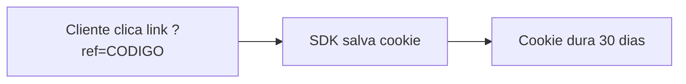
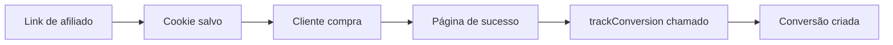
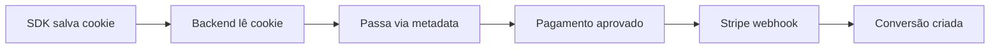
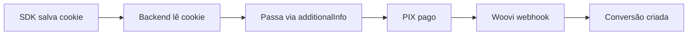
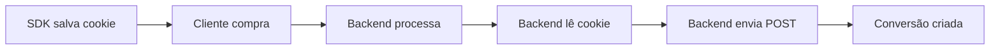

## Visão Geral

O sistema de rastreamento do Affiliatus funciona em **duas camadas**:

1. **SDK JavaScript (Base obrigatória):** Rastreia cliques, salva cookies e page views
2. **Método de Conversão (Escolha um):** Define como as vendas são enviadas

<Warning>
  **A SDK JavaScript é obrigatória para TODAS as integrações!** Ela gerencia os
  cookies com o código do afiliado. Sem ela, nenhuma conversão será atribuída
  corretamente.
</Warning>

---

## 1. Instale a SDK (Obrigatório)

Primeiro, instale a SDK JavaScript no seu site. Ela é a base de tudo:

<Card title="SDK JavaScript" icon="code" href="/integrations/sdk-javascript">
  **Instale primeiro!** Guia completo de instalação da SDK
</Card>

**O que a SDK faz:**

- ✅ Captura o código do afiliado da URL (`?ref=CODIGO`)
- ✅ Salva em um cookie que dura 30 dias
- ✅ Rastreia visualizações de página (page views)
- ✅ Pode enviar conversões (se usar método JavaScript)

---

## 2. Escolha o Método de Conversão

Depois da SDK instalada, escolha **como enviar as conversões (vendas)**:

<CardGroup cols={2}>
  <Card
    title="A. Via SDK JavaScript"
    icon="code"
    href="/integrations/sdk-javascript"
  >
    **Manual - Mais simples** Use a própria SDK para enviar conversões na página
    de sucesso. **Ideal para:** - Começar rápido - Checkout customizado - Não
    usa Stripe/Woovi
  </Card>

  <Card title="B. Via Stripe" icon="credit-card" href="/integrations/stripe">
    **Automático - Webhook** Conversões criadas automaticamente quando pagamento
    é aprovado. **Ideal para:** - Usa Stripe - Assinaturas recorrentes - Zero
    trabalho manual
  </Card>

  <Card title="C. Via Woovi" icon="barcode" href="/integrations/woovi">
    **Automático - Webhook** Conversões criadas automaticamente quando PIX é
    confirmado. **Ideal para:** - Usa Woovi/OpenPix - Pagamentos via PIX -
    Mercado brasileiro
  </Card>

  <Card title="D. Via API REST" icon="server" href="/integrations/api-rest">
    **Manual - Backend** Envie conversões do servidor após processar pagamento.
    **Ideal para:** - Mercado Pago/PagSeguro - Gateways não suportados -
    Controle total backend
  </Card>
</CardGroup>

---

## Comparação dos Métodos de Conversão

<Note>
  **Lembre-se:** A SDK JavaScript é obrigatória para todos! Esta tabela compara
  apenas os **métodos de envio de conversões**.
</Note>

| Característica       | A. SDK trackConversion() | B. Stripe Webhook | C. Woovi Webhook  | D. API REST |
| -------------------- | ------------------------ | ----------------- | ----------------- | ----------- |
| **SDK obrigatória?** | ✅ Sim                   | ✅ Sim            | ✅ Sim            | ✅ Sim      |
| **Automação**        | Manual                   | Automático        | Automático        | Manual      |
| **Complexidade**     | Baixa                    | Média             | Média             | Média       |
| **Gateway**          | Qualquer                 | Stripe            | Woovi             | Qualquer    |
| **Onde chama**       | Página sucesso           | Webhook           | Webhook           | Backend     |
| **Código extra**     | ✅ 3 linhas JS           | ✅ Config webhook | ✅ Config webhook | ✅ Backend  |
| **Manutenção**       | Baixa                    | Baixa             | Baixa             | Média       |

---

## Fluxos de Integração

### Fluxo Base (Obrigatório)

**A SDK JavaScript deve estar instalada em TODOS os casos!**

---

### Método A: Conversão via SDK JavaScript

**Prós:**

- ✅ Mais simples para começar
- ✅ Funciona com qualquer gateway
- ✅ Apenas 3 linhas de código

**Contras:**

- ❌ Precisa chamar manualmente na página de sucesso
- ❌ Pode falhar se JavaScript estiver desabilitado

---

### Método B: Conversão via Stripe

**Prós:**

- ✅ Totalmente automático
- ✅ Zero trabalho manual na conversão
- ✅ Confiável e testado
- ✅ Suporta assinaturas

**Contras:**

- ❌ Apenas para quem usa Stripe
- ❌ Requer configuração de webhook

---

### Método C: Conversão via Woovi

**Prós:**

- ✅ Totalmente automático
- ✅ PIX instantâneo
- ✅ Taxas baixas (~1%)
- ✅ Perfeito para Brasil

**Contras:**

- ❌ Apenas para quem usa Woovi
- ❌ Requer configuração de webhook

---

### Método D: Conversão via API REST

**Prós:**

- ✅ Funciona com qualquer gateway (Mercado Pago, PagSeguro, etc)
- ✅ Server-side (mais seguro)
- ✅ Controle total do fluxo
- ✅ Não depende de JavaScript para conversão

**Contras:**

- ❌ Requer implementação no backend
- ❌ Precisa gerenciar API keys
- ❌ Rate limit (70 req/min)

---

## Qual Método de Conversão Escolher?

<Note>**Primeiro instale a SDK!** Depois escolha um dos métodos abaixo.</Note>

### Use **Método A (SDK trackConversion)** se:

- Você está começando e quer algo rápido
- Tem controle do código da página de sucesso
- Não usa Stripe ou Woovi
- Quer a solução mais simples (3 linhas de código)

### Use **Método B (Stripe)** se:

- Você usa Stripe para processar pagamentos
- Quer automação total de conversões
- Aceita cartão de crédito/débito
- Não quer chamar `trackConversion()` manualmente

### Use **Método C (Woovi)** se:

- Você usa Woovi/OpenPix
- Aceita PIX como pagamento
- Foca no mercado brasileiro
- Quer automação total com taxas menores

### Use **Método D (API REST)** se:

- Usa Mercado Pago, PagSeguro, Asaas ou outro gateway
- Processa pagamentos no backend
- Precisa de integração server-to-server
- Quer máxima segurança (API keys no servidor)

---

## Posso Usar Mais de Um Método?

**Sim!** Você pode combinar múltiplos métodos de conversão:

**Exemplos comuns:**

**Cenário 1: E-commerce Multi-Gateway**

- **SDK instalada** (obrigatória - rastreia cliques)
- **Método B (Stripe)** para assinaturas mensais (cartão)
- **Método C (Woovi)** para pagamentos únicos (PIX)
- **Método A (SDK)** como fallback para outros casos

**Cenário 2: SaaS com Diversos Gateways**

- **SDK instalada** (obrigatória - rastreia cliques)
- **Método D (API REST)** para Mercado Pago/PagSeguro
- **Método B (Stripe)** para clientes internacionais
- **Método C (Woovi)** para PIX brasileiro

<Tip>
  **Recomendação:** Comece apenas com SDK + Método A (trackConversion). Depois
  adicione Stripe/Woovi/API REST conforme seu negócio crescer.
</Tip>

---

## Primeiros Passos

### 1. Instale a SDK (Obrigatório)

<Card
  title="Instalar SDK JavaScript"
  icon="download"
  href="/integrations/sdk-javascript"
>
  **Comece aqui!** Instale a SDK no seu site (5 minutos)
</Card>

### 2. Escolha o Método de Conversão

<CardGroup cols={2}>
  <Card
    title="A. trackConversion()"
    icon="code"
    href="/integrations/sdk-javascript#rastreando-conversoes"
  >
    Mais simples para começar
  </Card>

  <Card title="B. Stripe" icon="credit-card" href="/integrations/stripe">
    Se usa Stripe (automático)
  </Card>

  <Card title="C. Woovi" icon="barcode" href="/integrations/woovi">
    Se usa Woovi/PIX (automático)
  </Card>

  <Card title="D. API REST" icon="server" href="/integrations/api-rest">
    Outros gateways (backend)
  </Card>
</CardGroup>

---

## Outras Integrações

Não encontrou seu gateway de pagamento? Você tem opções:

### Integrações em Roadmap

Planejamos suportar em breve:

- 🔜 Mercado Pago
- 🔜 PagSeguro
- 🔜 Asaas
- 🔜 PayPal

### Integração Customizada

Para outros gateways, você pode:

1. **Usar API REST** para enviar conversões do backend
2. **Usar SDK JavaScript** na página de confirmação
3. **Criar webhook customizado** via nossa API

<Note>Entre em contato se precisar de ajuda com integração customizada!</Note>

---

## Precisa de Ajuda?

<AccordionGroup>
  <Accordion icon="question" title="Posso trocar de método depois?">
    Sim! Você pode mudar a qualquer momento sem perder dados históricos.
  </Accordion>

  <Accordion icon="question" title="Quanto tempo leva para implementar?">
    - SDK JavaScript: 30min - 2h - Stripe: 15-30min - Woovi: 15-30min - API
    REST: 1-3h
  </Accordion>

  <Accordion icon="question" title="Qual é o mais confiável?">
    Todos são confiáveis. Webhooks (Stripe/Woovi) têm menos margem para erro por
    serem automáticos.
  </Accordion>

  <Accordion icon="question" title="E se meu gateway não estiver listado?">
    Use API REST (backend) ou SDK JavaScript (frontend) - ambos funcionam com
    qualquer gateway!
  </Accordion>
</AccordionGroup>

---

## Próximos Passos

Após configurar sua integração:

<CardGroup cols={2}>
  <Card
    title="API Reference"
    icon="book-open"
    href="/api-reference/introduction"
  >
    Documentação técnica completa da API
  </Card>

  <Card
    title="Testar integração"
    icon="flask"
    href="/quickstart#passo-6-rastreie-conversoes-vendas"
  >
    Faça testes antes de ir ao ar
  </Card>

  <Card
    title="Aprovar conversões"
    icon="check-circle"
    href="/quickstart#passo-7-aprove-conversoes-e-comissoes"
  >
    Aprenda a gerenciar aprovações
  </Card>

  <Card title="Dashboard" icon="chart-line" href="https://app.affiliatus.io">
    Acompanhe métricas em tempo real
  </Card>
</CardGroup>
