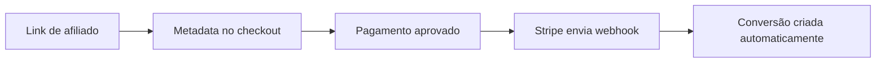
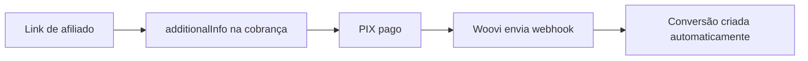

## Visão Geral

O Affiliatus oferece 4 formas principais de rastrear conversões (vendas) no seu programa de afiliados. Escolha a que melhor se adapta ao seu negócio.

---

## Métodos Disponíveis

<CardGroup cols={2}>
  <Card title="SDK JavaScript" icon="code" href="/integrations/sdk-javascript">
    **Manual**
    
    Rastreie conversões via código JavaScript na sua página de sucesso.
    
    **Ideal para:**
    - Checkout customizado
    - Controle total do código
    - Qualquer plataforma web
  </Card>
  
  <Card title="Stripe" icon="credit-card" href="/integrations/stripe">
    **Automático**
    
    Conversões criadas automaticamente via webhook do Stripe.
    
    **Ideal para:**
    - Pagamentos com cartão
    - Assinaturas recorrentes
    - Público internacional
  </Card>
  
  <Card title="Woovi/OpenPix" icon="barcode" href="/integrations/woovi">
    **Automático**
    
    Conversões criadas automaticamente quando o PIX é confirmado.
    
    **Ideal para:**
    - Pagamentos via PIX
    - Clientes brasileiros
    - Conversões instantâneas
  </Card>
  
  <Card title="API REST" icon="server" href="/integrations/api-rest">
    **Backend**
    
    Envie conversões direto do seu servidor usando API keys.
    
    **Ideal para:**
    - Integrações server-side
    - Gateways não suportados
    - Controle total backend
  </Card>
</CardGroup>

---

## Comparação

| Característica | SDK JavaScript | Stripe | Woovi | API REST |
|----------------|----------------|--------|-------|----------|
| **Automação** | Manual | Automático | Automático | Manual |
| **Complexidade** | Média | Baixa | Baixa | Média |
| **Método de pagamento** | Qualquer | Cartão | PIX | Qualquer |
| **Onde roda** | Frontend | Webhook | Webhook | Backend |
| **Velocidade** | Instantâneo | 1-3s | Instantâneo | Instantâneo |
| **Requer código** | ✅ Sim | ❌ Não | ❌ Não | ✅ Sim |
| **Webhook** | ❌ Não | ✅ Sim | ✅ Sim | ❌ Não |
| **Manutenção** | Alta | Baixa | Baixa | Média |

---

## Fluxo de Integração

### 1. SDK JavaScript (Manual)

**Prós:**
- ✅ Funciona com qualquer gateway de pagamento
- ✅ Máxima flexibilidade
- ✅ Sem dependência de terceiros

**Contras:**
- ❌ Requer implementação manual
- ❌ Mais sujeito a erros
- ❌ Precisa atualizar código

---

### 2. Stripe (Automático)

**Prós:**
- ✅ Totalmente automático
- ✅ Zero trabalho manual
- ✅ Confiável e testado
- ✅ Suporta assinaturas

**Contras:**
- ❌ Apenas para Stripe
- ❌ Depende de webhook
- ❌ Taxas do Stripe (~4.99%)

---

### 3. Woovi/OpenPix (Automático)

**Prós:**
- ✅ Totalmente automático
- ✅ PIX instantâneo
- ✅ Taxas baixas (~1%)
- ✅ Perfeito para Brasil

**Contras:**
- ❌ Apenas para Woovi
- ❌ Depende de webhook
- ❌ Limitado ao Brasil

---

### 4. API REST (Backend)

**Prós:**
- ✅ Funciona com qualquer gateway
- ✅ Server-side (mais seguro)
- ✅ Controle total do fluxo
- ✅ Não depende de JavaScript

**Contras:**
- ❌ Requer implementação manual
- ❌ Precisa gerenciar API keys
- ❌ Rate limit (70 req/min)

---

## Qual Escolher?

### Use **SDK JavaScript** se:

- Você tem checkout customizado
- Usa gateway não suportado (PagSeguro, Mercado Pago, etc)
- Precisa de controle total do fluxo
- Tem desenvolvedores disponíveis

### Use **Stripe** se:

- Você usa Stripe para processar pagamentos
- Quer automação total
- Aceita cartão de crédito/débito
- Tem clientes internacionais

### Use **Woovi** se:

- Você usa Woovi/OpenPix
- Aceita PIX como pagamento
- Foca no mercado brasileiro
- Quer taxas mais baixas

### Use **API REST** se:

- Processa pagamentos no backend
- Usa gateway não suportado (PagSeguro, Mercado Pago, etc)
- Precisa de integração server-to-server
- Quer máxima segurança (API keys no servidor)

---

## Posso Usar Mais de Uma?

**Sim!** Você pode combinar múltiplas integrações:

**Exemplos comuns:**

**Cenário 1:**
- **Stripe** para assinaturas mensais (cartão)
- **Woovi** para pagamentos únicos (PIX)
- **SDK JavaScript** como fallback

**Cenário 2:**
- **API REST** para Mercado Pago/PagSeguro
- **Stripe** para clientes internacionais
- **Woovi** para PIX

Cada conversão será criada pelo método que capturou a venda.

<Tip>
  Recomendamos começar com a integração mais usada no seu negócio e adicionar outras conforme necessário.
</Tip>

---

## Primeiros Passos

Escolha um método abaixo para começar:

<CardGroup cols={2}>
  <Card title="SDK JavaScript" icon="arrow-right" href="/integrations/sdk-javascript">
    Ver guia completo
  </Card>
  
  <Card title="Stripe" icon="arrow-right" href="/integrations/stripe">
    Ver guia completo
  </Card>
  
  <Card title="Woovi" icon="arrow-right" href="/integrations/woovi">
    Ver guia completo
  </Card>
  
  <Card title="API REST" icon="arrow-right" href="/integrations/api-rest">
    Ver guia completo
  </Card>
</CardGroup>

---

## Outras Integrações

Não encontrou seu gateway de pagamento? Você tem opções:

### Integrações em Roadmap

Planejamos suportar em breve:
- 🔜 Mercado Pago
- 🔜 PagSeguro
- 🔜 Asaas
- 🔜 PayPal

### Integração Customizada

Para outros gateways, você pode:

1. **Usar API REST** para enviar conversões do backend
2. **Usar SDK JavaScript** na página de confirmação
3. **Criar webhook customizado** via nossa API

<Note>
  Entre em contato se precisar de ajuda com integração customizada!
</Note>

---

## Precisa de Ajuda?

<AccordionGroup>
  <Accordion icon="question" title="Posso trocar de método depois?">
    Sim! Você pode mudar a qualquer momento sem perder dados históricos.
  </Accordion>
  
  <Accordion icon="question" title="Quanto tempo leva para implementar?">
    - SDK JavaScript: 30min - 2h
    - Stripe: 15-30min
    - Woovi: 15-30min
    - API REST: 1-3h
  </Accordion>
  
  <Accordion icon="question" title="Qual é o mais confiável?">
    Todos são confiáveis. Webhooks (Stripe/Woovi) têm menos margem para erro por serem automáticos.
  </Accordion>
  
  <Accordion icon="question" title="E se meu gateway não estiver listado?">
    Use API REST (backend) ou SDK JavaScript (frontend) - ambos funcionam com qualquer gateway!
  </Accordion>
</AccordionGroup>

---

## Próximos Passos

Após configurar sua integração:

<CardGroup cols={2}>
  <Card title="Testar integração" icon="flask" href="/quickstart#passo-6-rastreie-conversoes-vendas">
    Faça testes antes de ir ao ar
  </Card>
  
  <Card title="Aprovar conversões" icon="check-circle" href="/quickstart#passo-7-aprove-conversoes-e-comissoes">
    Aprenda a gerenciar aprovações
  </Card>
  
  <Card title="Dashboard" icon="chart-line" href="/quickstart">
    Acompanhe métricas em tempo real
  </Card>
  
  <Card title="Pagamentos" icon="wallet" href="/quickstart#passo-8-processe-os-pagamentos">
    Processe pagamentos de afiliados
  </Card>
</CardGroup>

