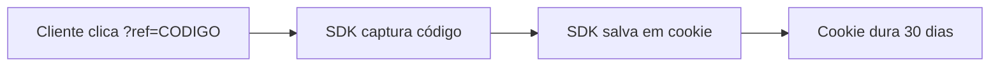
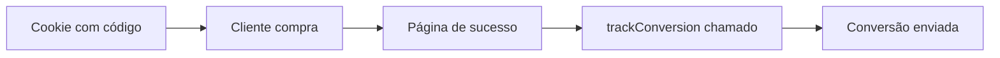

## Visão Geral

A SDK JavaScript é a **base de todas as integrações** do Affiliatus. Ela é responsável por:

1. **Capturar o código do afiliado** da URL (`?ref=CODIGO`)
2. **Salvar em um cookie** que dura 30 dias
3. **Rastrear page views** automaticamente
4. **Enviar conversões** (se você usar este método)

<Warning>
  **A SDK é obrigatória!** Mesmo que você use Stripe, Woovi ou API REST, você PRECISA instalar a SDK primeiro. 
  Sem ela, o sistema não consegue saber qual afiliado trouxe o cliente.
</Warning>

**Esta página ensina:**
- <Icon icon="check" color="#db2777" /> Como instalar a SDK (obrigatório para todos)
- <Icon icon="check" color="#db2777" /> Como usar `trackConversion()` para enviar vendas (opcional se usar Stripe/Woovi/API REST)

---

## Como Funciona

### 1. Rastreamento Automático (Obrigatório)



**Isso acontece automaticamente quando a SDK está instalada!**

### 2. Conversão Manual (Opcional)

Se você **NÃO** usar Stripe/Woovi/API REST, use este método:



<Note>
  O cookie dura 30 dias por padrão. Mesmo que o cliente volte dias depois, a conversão ainda será atribuída ao afiliado!
</Note>

---

## Instalação da SDK (Obrigatório)

### Passo 1: Adicione o SDK no `<head>`

<Warning>
  **Este passo é obrigatório para TODAS as integrações!** Sem a SDK instalada, Stripe, Woovi e API REST não funcionarão.
</Warning>

Adicione este código dentro da tag `<head>` de **todas as páginas** do seu site:

```html
<script src="https://cdn.affiliatus.io/latest/affiliatus.min.js"></script>

<script>
    var tracker = window.affiliatus.init('SEU_ID_DA_CAMPANHA', {
        autoPageView: true,
        attributionModel: 'last_click',
        cookieDuration: 30
    });
</script>
```

<Warning>Substitua `SEU_ID_DA_CAMPANHA` pelo ID real da sua campanha. Você encontra isso em "Como integrar" no dashboard.</Warning>

**Pronto! A SDK já está funcionando e salvando cookies automaticamente.**

<Tip>
  Se você vai usar Stripe, Woovi ou API REST para enviar conversões, **pode parar aqui**. 
  A SDK já está fazendo seu trabalho (salvar cookies). Vá para o guia específico da sua integração.
</Tip>

---

## Rastreando Conversões (Opcional)

<Note>
  Esta seção é apenas se você **NÃO** vai usar Stripe, Woovi ou API REST. 
  Se vai usar algum deles, pule para o [guia específico](/integrations/introduction).
</Note>

### Método Básico

Na sua **página de confirmação de compra** (ex: `/obrigado`, `/sucesso`, `/pedido-confirmado`), adicione:

```javascript
tracker.trackConversion({
  order_id: 'PEDIDO-12345',
  order_value: 299.90
});
```

### Exemplo Completo

```html
<!DOCTYPE html>
<html>
<head>
  <!-- SDK já instalado no head -->
  <script src="https://cdn.affiliatus.io/latest/affiliatus.min.js"></script>
  <script>
    var tracker = window.affiliatus.init('abc-123-def', {
      autoPageView: true
    });
  </script>
</head>
<body>
  <h1>Pedido Confirmado!</h1>
  <p>Obrigado pela sua compra!</p>

  <script>
    // Rastrear conversão
    tracker.trackConversion({
      order_id: 'ORD-98765',
      order_value: 149.90,
      product: 'Plano Premium',
      currency: 'BRL'
    });
  </script>
</body>
</html>
```

---

## Parâmetros

### Obrigatórios

| Parâmetro | Tipo | Descrição |
|-----------|------|-----------|
| `order_value` | Number | Valor total da venda em reais (ex: `99.90`) |

### Recomendados

| Parâmetro | Tipo | Descrição |
|-----------|------|-----------|
| `order_id` | String | ID único do pedido (ex: `"PEDIDO-123"`) |

### Opcionais

| Parâmetro | Tipo | Descrição |
|-----------|------|-----------|
| `product` | String | Nome do produto/plano vendido |
| `currency` | String | Moeda (padrão: `"BRL"`) |
| `quantity` | Number | Quantidade de itens |
| `customer_email` | String | E-mail do cliente |

---

## Exemplos de Uso

### E-commerce Simples

```javascript
tracker.trackConversion({
  order_id: 'PED-45678',
  order_value: 299.90,
  product: 'Kit Completo',
  quantity: 1
});
```

### SaaS com Assinatura

```javascript
tracker.trackConversion({
  order_id: 'SUB-' + Date.now(),
  order_value: 97.00,
  product: 'Plano Pro - Mensal',
  customer_email: 'cliente@email.com'
});
```

### Checkout Customizado

```javascript
// Capturar dados do pedido
const pedidoId = document.getElementById('order-id').value;
const valorTotal = parseFloat(document.getElementById('total').value);

// Enviar conversão
tracker.trackConversion({
  order_id: pedidoId,
  order_value: valorTotal,
  product: 'Curso Online',
  currency: 'BRL'
});
```

---

## Integração com Plataformas

### WordPress + WooCommerce

Adicione no arquivo `functions.php` do seu tema:

```php
add_action('woocommerce_thankyou', 'rastrear_conversao_afiliado');

function rastrear_conversao_afiliado($order_id) {
    $order = wc_get_order($order_id);
    $total = $order->get_total();
    ?>
    <script>
        if (typeof tracker !== 'undefined') {
            tracker.trackConversion({
                order_id: '<?php echo $order_id; ?>',
                order_value: <?php echo $total; ?>,
                product: 'Pedido WooCommerce'
            });
        }
    </script>
    <?php
}
```

### Shopify (via Liquid)

Na página de confirmação (`checkout.liquid` ou `thank-you.liquid`):

```liquid
<script>
  tracker.trackConversion({
    order_id: '{{ order.order_number }}',
    order_value: {{ order.total_price | money_without_currency }},
    product: '{{ order.line_items[0].product.title }}'
  });
</script>
```

### React/Next.js

```jsx
import { useEffect } from 'react';
import { useRouter } from 'next/router';

export default function SuccessPage() {
  const router = useRouter();
  const { orderId, total } = router.query;

  useEffect(() => {
    if (window.tracker && orderId && total) {
      window.tracker.trackConversion({
        order_id: orderId,
        order_value: parseFloat(total),
        product: 'Compra Online'
      });
    }
  }, [orderId, total]);

  return (
    <div>
      <h1>Compra Confirmada!</h1>
      <p>Pedido: {orderId}</p>
    </div>
  );
}
```

---

## Testando a Integração

### 1. Teste com Link de Afiliado

1. Crie um afiliado no dashboard (ex: código `TEST01`)
2. Acesse seu site com: `https://seusite.com?ref=TEST01`
3. Navegue até a página de checkout
4. Finalize uma compra de teste
5. Verifique no dashboard se a conversão foi criada

### 2. Verifique no Console

Abra o console do navegador (F12) e digite:

```javascript
// Ver se o tracker está carregado
console.log(window.tracker);

// Testar conversão manualmente
tracker.trackConversion({
  order_id: 'TEST-' + Date.now(),
  order_value: 99.90
});
```

### 3. Ative o Debug

Para ver logs detalhados durante o desenvolvimento:

```javascript
var tracker = window.affiliatus.init('SEU_ID_DA_CAMPANHA', {
  debug: true,  // <- Ativa logs no console
  autoPageView: true
});
```

---

## Solução de Problemas

### Conversão não aparece no dashboard

**Possíveis causas:**

1. **Domínio não autorizado**
   - Vá em "Configurações" → "Domínios"
   - Adicione o domínio do seu site

2. **SDK não carregado**
   - Verifique se o script está no `<head>`
   - Abra o console e digite `window.tracker`

3. **Código de afiliado não capturado**
   - Teste acessando com `?ref=CODIGO`
   - Verifique se o cookie foi criado (F12 → Application → Cookies)

4. **Erro no JavaScript**
   - Abra o console (F12) e procure erros em vermelho
   - Verifique se `tracker.trackConversion()` está sendo chamado

### Conversão duplicada

Se a mesma conversão está sendo criada 2x:

- Use o `order_id` único para cada pedido
- O sistema ignora conversões duplicadas com mesmo `order_id`

### Cookie não persiste

Se o cookie some após o cliente navegar:

- Verifique se seu site está em HTTPS (cookies exigem SSL)
- Confirme que o domínio está correto
- Teste em modo anônimo para verificar

---

## Boas Práticas

### <Icon icon="check" color="#db2777" /> Faça

- <Icon icon="check" color="#db2777" /> Use `order_id` único para cada venda
- <Icon icon="check" color="#db2777" /> Teste em ambiente de staging primeiro
- <Icon icon="check" color="#db2777" /> Adicione o código na página de sucesso/confirmação
- <Icon icon="check" color="#db2777" /> Valide se o tracker está carregado antes de chamar
- <Icon icon="check" color="#db2777" /> Use valores decimais para `order_value` (ex: `99.90`)

### <Icon icon="x" /> Não Faça

- <Icon icon="x" /> Não coloque o código na página de checkout (antes da compra)
- <Icon icon="x" /> Não chame `trackConversion()` múltiplas vezes para o mesmo pedido
- <Icon icon="x" /> Não use valores inteiros truncados (ex: use `99.90` em vez de `99`)
- <Icon icon="x" /> Não esqueça de adicionar o domínio nos autorizados

---

## Próximos Passos

<CardGroup cols={2}>
  <Card title="Aprovar conversões" icon="check-circle" href="/quickstart#passo-7-aprove-conversoes-e-comissoes">
    Aprenda a aprovar conversões e liberar comissões
  </Card>
  
  <Card title="Processar pagamentos" icon="wallet" href="/quickstart#passo-8-processe-os-pagamentos">
    Veja como pagar seus afiliados
  </Card>
  
  <Card title="Integração Stripe" icon="stripe" href="/integrations/stripe">
    Automatize conversões com Stripe
  </Card>
  
  <Card title="Integração Woovi" icon="barcode" href="/integrations/woovi">
    Automatize conversões com PIX via Woovi
  </Card>
</CardGroup>

---

## Precisa de Ajuda?

<AccordionGroup>
  <Accordion icon="question" title="Posso rastrear outras conversões além de vendas?">
    Sim! Use `tracker.trackLead()` para capturar leads (ex: formulário preenchido) antes da venda.
  </Accordion>
  
  <Accordion icon="question" title="Funciona com Single Page Applications (SPA)?">
    Sim! O tracker funciona perfeitamente com React, Vue, Angular e outros frameworks modernos.
  </Accordion>
  
  <Accordion icon="question" title="O que acontece se eu chamar trackConversion() 2 vezes?">
    Se usar o mesmo `order_id`, o sistema ignora a segunda chamada (evita duplicação).
  </Accordion>
  
  <Accordion icon="question" title="Preciso instalar algo no servidor?">
    Não! Tudo funciona no browser. Basta adicionar o JavaScript na página.
  </Accordion>
</AccordionGroup>

<Note>
  **Dúvidas?** Entre em contato pelo suporte ou consulte a [documentação completa](/).
</Note>

