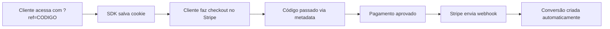

## Visão Geral

A integração com Stripe cria conversões **automaticamente** quando um pagamento é aprovado no Stripe. Você não precisa chamar `trackConversion()` manualmente - tudo é feito via webhook.

<Warning>
  **Pré-requisito:** A [SDK JavaScript](/integrations/sdk-javascript) deve estar
  instalada no seu site! Ela é responsável por salvar o cookie com o código do
  afiliado. Esta integração Stripe é **complementar** à SDK.
</Warning>

**Quando usar:**

- Você usa Stripe para processar pagamentos
- Quer automação total de conversões
- Processa assinaturas recorrentes ou pagamentos únicos
- Já tem a SDK instalada

---

## Como Funciona



1. **SDK salva cookie:** Cliente acessa com `?ref=CODIGO`, SDK salva no cookie
2. **Metadata no checkout:** Seu backend lê o cookie e passa para o Stripe
3. Cliente finaliza compra no Stripe
4. Stripe aprova o pagamento
5. **Stripe envia webhook** com o código do afiliado
6. **Conversão é criada automaticamente** ✨

<Note>
  **Papel da SDK:** Ela salva o código do afiliado em um cookie que dura 30
  dias. Seu backend lê esse cookie e passa para o Stripe via metadata.
</Note>

---

## Configuração

### Passo 1: Ative a Integração no Dashboard

1. Vá em **"Configurações"** → **"Integrações"**
2. Encontre o card do **Stripe**
3. Clique em **"Ativar"**
4. Anote a **URL do Webhook** (você vai precisar)

A URL será algo como:

```
https://api.affiliatus.io/api/campaigns/{SEU_ID}/stripe/webhook
```

---

### Passo 2: Crie o Webhook no Stripe

1. Acesse o [Dashboard do Stripe](https://dashboard.stripe.com/webhooks)
2. Clique em **"Add endpoint"**
3. Cole a URL do webhook copiada no passo anterior
4. Em **"Events to send"**, selecione:

   - ✅ `checkout.session.completed`
   - ✅ `payment_intent.succeeded` (opcional, para redundância)

5. Clique em **"Add endpoint"**
6. Copie o **Signing Secret** (começa com `whsec_...`)

<Warning>
  Guarde o Signing Secret em local seguro! Ele é necessário para validar os
  webhooks.
</Warning>

---

### Passo 3: Configure o Signing Secret

1. Volte para o dashboard do Affiliatus
2. Em **"Configurações"** → **"Integrações"** → **Stripe**
3. Cole o **Signing Secret** no campo correspondente
4. Clique em **"Salvar"**

<Tip>
  O Signing Secret garante que apenas webhooks legítimos do Stripe sejam
  aceitos.
</Tip>

---

## Enviando Código do Afiliado

Existem 2 formas de informar ao Stripe qual afiliado trouxe a venda:

### Método 1: Via Metadata (Recomendado)

Adicione o código do afiliado no `metadata` da sessão de checkout:

```javascript
const session = await stripe.checkout.sessions.create({
  payment_method_types: ["card"],
  line_items: [
    {
      price: "price_1234567890",
      quantity: 1,
    },
  ],
  mode: "subscription", // ou 'payment'
  success_url: "https://seusite.com/sucesso",
  cancel_url: "https://seusite.com/cancelado",

  metadata: {
    affiliate_code: "JOAO1", // <- Código do afiliado
  },
});
```

<Note>
  O código pode vir de um cookie, query string (?ref=JOAO1) ou campo no
  formulário.
</Note>

---

### Método 2: Via Cupom de Desconto

Se o afiliado tem um cupom exclusivo no Stripe:

```javascript
const session = await stripe.checkout.sessions.create({
  payment_method_types: ["card"],
  line_items: [
    {
      price: "price_1234567890",
      quantity: 1,
    },
  ],
  mode: "subscription",
  success_url: "https://seusite.com/sucesso",
  cancel_url: "https://seusite.com/cancelado",

  discounts: [
    {
      coupon: "JOAO1", // <- Código do cupom = código do afiliado
    },
  ],
});
```

Neste caso, você precisa **mapear o cupom ao afiliado** no dashboard:

1. Vá em **"Configurações"** → **"Mapeamento de Cupons"**
2. Associe o cupom `JOAO1` ao afiliado correspondente

---

## Exemplos de Implementação

### Next.js/React

```typescript
// pages/api/create-checkout-session.ts
import Stripe from "stripe";
import { NextApiRequest, NextApiResponse } from "next";

const stripe = new Stripe(process.env.STRIPE_SECRET_KEY!);

export default async function handler(
  req: NextApiRequest,
  res: NextApiResponse
) {
  if (req.method !== "POST") {
    return res.status(405).json({ error: "Method not allowed" });
  }

  try {
    const { priceId, affiliateCode } = req.body;

    const session = await stripe.checkout.sessions.create({
      payment_method_types: ["card"],
      line_items: [
        {
          price: priceId,
          quantity: 1,
        },
      ],
      mode: "subscription",
      success_url: `${process.env.NEXT_PUBLIC_URL}/sucesso?session_id={CHECKOUT_SESSION_ID}`,
      cancel_url: `${process.env.NEXT_PUBLIC_URL}/cancelado`,

      // Passar código do afiliado no metadata
      metadata: {
        affiliate_code: affiliateCode || null,
      },
    });

    res.status(200).json({ sessionId: session.id });
  } catch (error) {
    res.status(500).json({ error: error.message });
  }
}
```

**Componente React:**

```jsx
import { loadStripe } from "@stripe/stripe-js";
import { useState, useEffect } from "react";

const stripePromise = loadStripe(process.env.NEXT_PUBLIC_STRIPE_KEY);

export default function CheckoutButton() {
  const [affiliateCode, setAffiliateCode] = useState(null);

  // Capturar código do afiliado do cookie ou URL
  useEffect(() => {
    const urlParams = new URLSearchParams(window.location.search);
    const code = urlParams.get("ref") || getCookie("aff_ref");
    setAffiliateCode(code);
  }, []);

  const handleCheckout = async () => {
    const response = await fetch("/api/create-checkout-session", {
      method: "POST",
      headers: { "Content-Type": "application/json" },
      body: JSON.stringify({
        priceId: "price_1234567890",
        affiliateCode: affiliateCode,
      }),
    });

    const { sessionId } = await response.json();
    const stripe = await stripePromise;

    await stripe.redirectToCheckout({ sessionId });
  };

  return <button onClick={handleCheckout}>Assinar Agora</button>;
}

function getCookie(name) {
  const match = document.cookie.match(new RegExp("(^| )" + name + "=([^;]+)"));
  return match ? match[2] : null;
}
```

---

### Node.js (Express)

```javascript
const express = require("express");
const stripe = require("stripe")(process.env.STRIPE_SECRET_KEY);
const app = express();

app.post("/create-checkout-session", async (req, res) => {
  const { priceId, affiliateCode } = req.body;

  try {
    const session = await stripe.checkout.sessions.create({
      payment_method_types: ["card"],
      line_items: [{ price: priceId, quantity: 1 }],
      mode: "subscription",
      success_url: "https://seusite.com/sucesso",
      cancel_url: "https://seusite.com/cancelado",

      metadata: {
        affiliate_code: affiliateCode || null,
      },
    });

    res.json({ sessionId: session.id });
  } catch (error) {
    res.status(500).json({ error: error.message });
  }
});

app.listen(3000);
```

---

### PHP (Laravel)

```php
use Stripe\Stripe;
use Stripe\Checkout\Session;

Route::post('/create-checkout-session', function (Request $request) {
    Stripe::setApiKey(env('STRIPE_SECRET_KEY'));

    $affiliateCode = $request->cookie('aff_ref') ?? $request->input('ref');

    $session = Session::create([
        'payment_method_types' => ['card'],
        'line_items' => [[
            'price' => 'price_1234567890',
            'quantity' => 1,
        ]],
        'mode' => 'subscription',
        'success_url' => url('/sucesso'),
        'cancel_url' => url('/cancelado'),

        'metadata' => [
            'affiliate_code' => $affiliateCode,
        ],
    ]);

    return response()->json(['sessionId' => $session->id]);
});
```

---

### Python (Django)

```python
import stripe
from django.http import JsonResponse
from django.views.decorators.csrf import csrf_exempt

stripe.api_key = os.environ.get('STRIPE_SECRET_KEY')

@csrf_exempt
def create_checkout_session(request):
    if request.method == 'POST':
        affiliate_code = request.COOKIES.get('aff_ref')

        session = stripe.checkout.Session.create(
            payment_method_types=['card'],
            line_items=[{
                'price': 'price_1234567890',
                'quantity': 1,
            }],
            mode='subscription',
            success_url='https://seusite.com/sucesso',
            cancel_url='https://seusite.com/cancelado',

            metadata={
                'affiliate_code': affiliate_code,
            },
        )

        return JsonResponse({'sessionId': session.id})
```

---

## Testando a Integração

### 1. Teste com Stripe Test Mode

1. Use as [chaves de teste do Stripe](https://dashboard.stripe.com/test/apikeys)
2. Crie uma checkout session com `metadata.affiliate_code`
3. Use o cartão de teste: `4242 4242 4242 4242`
4. Complete o pagamento
5. Verifique se a conversão apareceu no dashboard

### 2. Use o Stripe CLI para Simular Webhooks

```bash
# Instalar Stripe CLI
brew install stripe/stripe-cli/stripe

# Login
stripe login

# Escutar webhooks localmente
stripe listen --forward-to https://api.affiliatus.io/api/campaigns/SEU_ID/stripe/webhook

# Disparar evento de teste
stripe trigger checkout.session.completed
```

### 3. Verifique os Logs

No dashboard do Stripe:

1. Vá em **"Developers"** → **"Webhooks"**
2. Clique no seu webhook
3. Veja a lista de eventos enviados
4. Verifique se retornou status `200 OK`

---

## Solução de Problemas

### Webhook retorna erro 401 ou 403

**Causa:** Signing Secret incorreto ou integração não ativada.

**Solução:**

1. Verifique se a integração está ativa no dashboard
2. Confirme que o Signing Secret está correto
3. Tente reativar a integração

---

### Conversão não é criada

**Possíveis causas:**

1. **Metadata não enviado**

   - Verifique se `metadata.affiliate_code` está sendo passado
   - Confirme o valor no evento do Stripe

2. **Código de afiliado inválido**

   - O código deve corresponder a um afiliado ativo
   - Verifique em "Afiliados" se o código existe

3. **Webhook não configurado**

   - Confirme que o webhook está ativo no Stripe
   - Verifique se o evento `checkout.session.completed` está selecionado

4. **Evento duplicado**
   - O sistema ignora eventos já processados
   - Cada `payment_intent` só gera uma conversão

---

### Valor da conversão está errado

O valor é capturado diretamente do Stripe em centavos e convertido para reais.

**Exemplo:**

- Stripe: `amount_total: 9900` (centavos)
- Conversão: `order_value: 99.00` (reais)

Se o valor estiver incorreto, verifique o `amount_total` no evento do Stripe.

---

## Configurações Avançadas

### Permitir Metadata e/ou Cupom

No dashboard, em **"Integrações"** → **"Stripe"**, você pode configurar:

- ✅ **Permitir Metadata**: Aceita `metadata.affiliate_code`
- ✅ **Permitir Cupom**: Aceita cupons mapeados

<Tip>Recomendamos ativar ambos para máxima flexibilidade.</Tip>

---

### Mapeamento de Cupons

Se você usa cupons de desconto como identificadores de afiliados:

1. Vá em **"Configurações"** → **"Mapeamento de Cupons"**
2. Clique em **"Adicionar Mapeamento"**
3. Selecione o cupom do Stripe
4. Associe ao afiliado correspondente

**Exemplo:**

- Cupom: `DESCONTO10JOAO`
- Afiliado: João Silva (código `JOAO1`)

---

## Boas Práticas

### ✅ Faça

- ✅ Sempre teste em Test Mode primeiro
- ✅ Use metadata ao invés de cupons (mais confiável)
- ✅ Configure o Signing Secret corretamente
- ✅ Monitore os logs de webhook no Stripe
- ✅ Mantenha as chaves de API seguras

### ❌ Não Faça

- ❌ Não exponha chaves secretas no frontend
- ❌ Não desative o webhook sem avisar os afiliados
- ❌ Não modifique o `metadata` após criar a sessão
- ❌ Não use cupons genéricos para múltiplos afiliados

---

## Próximos Passos

<CardGroup cols={2}>
  <Card
    title="Aprovar conversões"
    icon="check-circle"
    href="/quickstart#passo-7-aprove-conversoes-e-comissoes"
  >
    Aprenda a aprovar conversões automáticas
  </Card>

  <Card title="Integração Woovi" icon="barcode" href="/integrations/woovi">
    Automatize conversões via PIX
  </Card>

  <Card title="SDK JavaScript" icon="code" href="/integrations/sdk-javascript">
    Rastreamento manual via JavaScript
  </Card>

  <Card
    title="Dashboard"
    icon="chart-line"
    href="/quickstart#passo-7-aprove-conversoes-e-comissoes"
  >
    Acompanhe métricas em tempo real
  </Card>
</CardGroup>

---

## Precisa de Ajuda?

<AccordionGroup>
  <Accordion icon="question" title="Funciona com Stripe Connect?">
    Não diretamente no momento. Use metadata no checkout da conta conectada e
    processe via API.
  </Accordion>

  <Accordion icon="question" title="Posso usar com assinaturas recorrentes?">
    Sim! Funciona tanto com `mode: 'subscription'` quanto `mode: 'payment'`.
  </Accordion>

  <Accordion
    icon="question"
    title="O que acontece se o pagamento for reembolsado?"
  >
    A conversão permanece no sistema. Você pode rejeitá-la manualmente se
    necessário.
  </Accordion>

  <Accordion icon="question" title="Preciso da SDK JavaScript também?">
    Sim! A SDK é obrigatória para salvar o código do afiliado no cookie. Sem
    ela, o webhook do Stripe não terá como saber qual afiliado trouxe a venda.
  </Accordion>
</AccordionGroup>

<Note>
  **Dúvidas?** Entre em contato pelo suporte ou consulte a [documentação do
  Stripe](https://stripe.com/docs/webhooks).
</Note>
