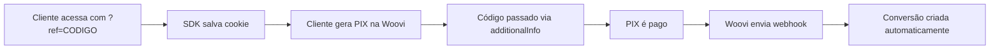

## Visão Geral

A integração com Woovi (OpenPix) cria conversões **automaticamente** quando um pagamento via PIX é confirmado. Perfeito para quem aceita PIX como forma de pagamento!

<Warning>
  **Pré-requisito:** A [SDK JavaScript](/integrations/sdk-javascript) deve estar
  instalada no seu site! Ela é responsável por salvar o cookie com o código do
  afiliado. Esta integração Woovi é **complementar** à SDK.
</Warning>

**Quando usar:**

- Você usa Woovi/OpenPix para processar PIX
- Quer automação total de conversões
- Aceita pagamentos instantâneos via PIX
- Já tem a SDK instalada

---

## Como Funciona



1. **SDK salva cookie:** Cliente acessa com `?ref=CODIGO`, SDK salva no cookie
2. **additionalInfo na cobrança:** Seu backend lê o cookie e passa para a Woovi
3. Cliente escaneia QR Code e paga o PIX
4. Woovi confirma o pagamento
5. **Woovi envia webhook** com o código do afiliado
6. **Conversão é criada automaticamente** <Icon icon="sparkles" />

<Note>
  **Papel da SDK:** Ela salva o código do afiliado em um cookie que dura 30
  dias. Seu backend lê esse cookie e passa para a Woovi via additionalInfo.
</Note>

---

## Configuração

### Passo 1: Ative a Integração no Dashboard

1. Vá em **"Configurações"** → **"Integrações"**
2. Encontre o card da **Woovi**
3. Clique em **"Ativar"**
4. Anote a **URL do Webhook** (você vai precisar)

A URL será algo como:

```
https://api.affiliatus.io/api/campaigns/{SEU_ID}/woovi/webhook
```

---

### Passo 2: Crie o Webhook na Woovi

1. Acesse o [Dashboard da Woovi](https://app.woovi.com/home/webhooks)
2. Clique em **"Novo Webhook"**
3. Cole a URL do webhook copiada no passo anterior
4. Selecione os eventos:

   - <Icon icon="check" color="#db2777" /> `OPENPIX:CHARGE_COMPLETED`
   - <Icon icon="check" color="#db2777" /> `OPENPIX:CHARGE_EXPIRED` (opcional)

5. Clique em **"Criar"**

<Tip>
  A Woovi envia um evento de teste automaticamente. Se retornar sucesso, está
  tudo certo!
</Tip>

---

### Passo 3: Configure sua Chave API (opcional)

Se quiser validar assinaturas dos webhooks:

1. Na Woovi, vá em **"API/Plugins"** → **"Chaves de API"**
2. Copie sua **App ID**
3. No Affiliatus, em **"Integrações"** → **"Woovi"**
4. Cole o **App ID** e salve

<Note>
  A validação de assinatura é opcional mas recomendada para segurança adicional.
</Note>

---

## Enviando Código do Afiliado

Você precisa incluir o código do afiliado no campo `additionalInfo` ao criar a cobrança PIX:

### API da Woovi

```javascript
const response = await fetch("https://api.openpix.com.br/api/v1/charge", {
  method: "POST",
  headers: {
    Authorization: "SEU_APP_ID",
    "Content-Type": "application/json",
  },
  body: JSON.stringify({
    value: 9990, // Valor em centavos (R$ 99,90)
    correlationID: "PEDIDO-12345",
    comment: "Compra no site",

    additionalInfo: [
      {
        key: "affiliate_code",
        value: "JOAO1", // <- Código do afiliado
      },
      {
        key: "product",
        value: "Plano Premium",
      },
    ],
  }),
});

const data = await response.json();
console.log(data.qrCodeImage); // QR Code para o cliente
```

<Warning>
  O campo `affiliate_code` no `additionalInfo` é obrigatório para rastrear o
  afiliado!
</Warning>

---

## Exemplos de Implementação

### Next.js/React

```typescript
// pages/api/create-pix-charge.ts
import { NextApiRequest, NextApiResponse } from "next";

export default async function handler(
  req: NextApiRequest,
  res: NextApiResponse
) {
  if (req.method !== "POST") {
    return res.status(405).json({ error: "Method not allowed" });
  }

  try {
    const { value, orderId, affiliateCode } = req.body;

    const response = await fetch("https://api.openpix.com.br/api/v1/charge", {
      method: "POST",
      headers: {
        Authorization: process.env.WOOVI_APP_ID!,
        "Content-Type": "application/json",
      },
      body: JSON.stringify({
        value: Math.round(value * 100), // Converter para centavos
        correlationID: orderId,
        comment: "Pagamento via PIX",

        additionalInfo: [
          {
            key: "affiliate_code",
            value: affiliateCode || null,
          },
          {
            key: "order_id",
            value: orderId,
          },
        ],
      }),
    });

    const data = await response.json();

    res.status(200).json({
      qrCode: data.qrCodeImage,
      pixCode: data.brCode,
      chargeId: data.charge.correlationID,
    });
  } catch (error) {
    res.status(500).json({ error: error.message });
  }
}
```

**Componente React:**

```jsx
import { useState, useEffect } from "react";
import QRCode from "react-qr-code";

export default function PixCheckout() {
  const [affiliateCode, setAffiliateCode] = useState(null);
  const [pixData, setPixData] = useState(null);
  const [loading, setLoading] = useState(false);

  // Capturar código do afiliado
  useEffect(() => {
    const urlParams = new URLSearchParams(window.location.search);
    const code = urlParams.get("ref") || getCookie("aff_ref");
    setAffiliateCode(code);
  }, []);

  const generatePix = async () => {
    setLoading(true);

    const response = await fetch("/api/create-pix-charge", {
      method: "POST",
      headers: { "Content-Type": "application/json" },
      body: JSON.stringify({
        value: 99.9,
        orderId: "PED-" + Date.now(),
        affiliateCode: affiliateCode,
      }),
    });

    const data = await response.json();
    setPixData(data);
    setLoading(false);
  };

  return (
    <div>
      <h1>Pagar com PIX</h1>

      {!pixData ? (
        <button onClick={generatePix} disabled={loading}>
          {loading ? "Gerando PIX..." : "Gerar QR Code"}
        </button>
      ) : (
        <div>
          <QRCode value={pixData.pixCode} size={256} />
          <p>Ou copie o código PIX:</p>
          <input type="text" value={pixData.pixCode} readOnly />
        </div>
      )}
    </div>
  );
}

function getCookie(name) {
  const match = document.cookie.match(new RegExp("(^| )" + name + "=([^;]+)"));
  return match ? match[2] : null;
}
```

---

### Node.js (Express)

```javascript
const express = require("express");
const axios = require("axios");
const app = express();

app.use(express.json());

app.post("/create-pix-charge", async (req, res) => {
  const { value, orderId, affiliateCode } = req.body;

  try {
    const response = await axios.post(
      "https://api.openpix.com.br/api/v1/charge",
      {
        value: Math.round(value * 100),
        correlationID: orderId,
        comment: "Pagamento PIX",

        additionalInfo: [
          {
            key: "affiliate_code",
            value: affiliateCode || null,
          },
        ],
      },
      {
        headers: {
          Authorization: process.env.WOOVI_APP_ID,
          "Content-Type": "application/json",
        },
      }
    );

    res.json({
      qrCode: response.data.qrCodeImage,
      pixCode: response.data.brCode,
    });
  } catch (error) {
    res.status(500).json({ error: error.message });
  }
});

app.listen(3000);
```

---

### PHP (Laravel)

```php
use Illuminate\Http\Request;
use Illuminate\Support\Facades\Http;

Route::post('/create-pix-charge', function (Request $request) {
    $affiliateCode = $request->cookie('aff_ref') ?? $request->input('ref');

    $response = Http::withHeaders([
        'Authorization' => env('WOOVI_APP_ID'),
        'Content-Type' => 'application/json',
    ])->post('https://api.openpix.com.br/api/v1/charge', [
        'value' => round($request->input('value') * 100),
        'correlationID' => $request->input('order_id'),
        'comment' => 'Pagamento via PIX',

        'additionalInfo' => [
            [
                'key' => 'affiliate_code',
                'value' => $affiliateCode,
            ]
        ],
    ]);

    return response()->json([
        'qrCode' => $response['qrCodeImage'],
        'pixCode' => $response['brCode'],
    ]);
});
```

---

### Python (Django)

```python
import requests
from django.http import JsonResponse
from django.views.decorators.csrf import csrf_exempt

@csrf_exempt
def create_pix_charge(request):
    if request.method == 'POST':
        affiliate_code = request.COOKIES.get('aff_ref')
        value = float(request.POST.get('value'))
        order_id = request.POST.get('order_id')

        response = requests.post(
            'https://api.openpix.com.br/api/v1/charge',
            headers={
                'Authorization': os.environ.get('WOOVI_APP_ID'),
                'Content-Type': 'application/json',
            },
            json={
                'value': round(value * 100),
                'correlationID': order_id,
                'comment': 'Pagamento PIX',

                'additionalInfo': [
                    {
                        'key': 'affiliate_code',
                        'value': affiliate_code,
                    }
                ],
            }
        )

        data = response.json()

        return JsonResponse({
            'qrCode': data['qrCodeImage'],
            'pixCode': data['brCode'],
        })
```

---

## Testando a Integração

### 1. Ambiente de Teste da Woovi

1. Use o [ambiente de sandbox da Woovi](https://developers.openpix.com.br/docs/sandbox)
2. Crie uma cobrança de teste com `additionalInfo`
3. Simule o pagamento no painel
4. Verifique se a conversão apareceu no dashboard

### 2. Use Webhooks de Teste

No dashboard da Woovi:

1. Vá em **"Webhooks"**
2. Clique em **"Testar Webhook"**
3. A Woovi enviará um evento de teste
4. Verifique se retornou `200 OK`

### 3. PIX Real (Ambiente de Produção)

Para testar com PIX real:

1. Crie uma cobrança com valor baixo (ex: R$ 1,00)
2. Pague o PIX com seu celular
3. Aguarde confirmação (geralmente instantâneo)
4. Verifique a conversão no dashboard

---

## Solução de Problemas

### Conversão não é criada

**Possíveis causas:**

1. **additionalInfo não enviado**

   - Verifique se `affiliate_code` está no `additionalInfo`
   - Confira no evento do webhook na Woovi

2. **Código de afiliado inválido**

   - O código deve corresponder a um afiliado ativo
   - Verifique em "Afiliados" se o código existe

3. **Webhook não configurado**

   - Confirme que o webhook está ativo na Woovi
   - Verifique se o evento `OPENPIX:CHARGE_COMPLETED` está selecionado

4. **Integração não ativada**
   - Vá em "Integrações" e ative a Woovi
   - Salve as configurações

---

### Webhook retorna erro

**Causa:** URL incorreta ou evento de teste não reconhecido.

**Solução:**

1. Verifique se a URL está correta
2. Confirme que a integração está ativa
3. Eventos de teste são ignorados - isso é normal!

---

### Valor da conversão está errado

O valor é capturado diretamente da Woovi em centavos e convertido para reais.

**Exemplo:**

- Woovi: `value: 9900` (centavos)
- Conversão: `order_value: 99.00` (reais)

Se o valor estiver incorreto, verifique o `value` enviado na criação da cobrança.

---

## Campos Suportados no additionalInfo

| Campo            | Obrigatório                               | Descrição                       |
| ---------------- | ----------------------------------------- | ------------------------------- |
| `affiliate_code` | <Icon icon="check" color="#db2777" /> Sim | Código único do afiliado        |
| `order_id`       | Recomendado                               | ID do pedido (evita duplicação) |
| `product`        | Opcional                                  | Nome do produto vendido         |
| `customer_email` | Opcional                                  | E-mail do cliente               |
| `customer_name`  | Opcional                                  | Nome do cliente                 |

**Exemplo completo:**

```javascript
additionalInfo: [
  { key: "affiliate_code", value: "JOAO1" },
  { key: "order_id", value: "PED-12345" },
  { key: "product", value: "Plano Premium" },
  { key: "customer_email", value: "cliente@email.com" },
  { key: "customer_name", value: "João Silva" },
];
```

---

## Diferenças entre Woovi e OpenPix

**Woovi** e **OpenPix** são o mesmo serviço! OpenPix foi renomeado para Woovi.

- A API continua usando o domínio `openpix.com.br`
- Os eventos de webhook usam prefixo `OPENPIX:`
- A documentação está em `developers.openpix.com.br`

<Note>Use os termos de forma intercambiável - ambos funcionam!</Note>

---

## Boas Práticas

### <Icon icon="check" color="#db2777" /> Faça

- <Icon icon="check" color="#db2777" /> Sempre teste no ambiente de sandbox primeiro
- <Icon icon="check" color="#db2777" /> Inclua `affiliate_code` no `additionalInfo`
- <Icon icon="check" color="#db2777" /> Use `correlationID` único para cada cobrança
- <Icon icon="check" color="#db2777" /> Monitore os logs de webhook na Woovi
- <Icon icon="check" color="#db2777" /> Armazene o `chargeId` para referência

### <Icon icon="x" /> Não Faça

- <Icon icon="x" /> Não exponha seu App ID no frontend
- <Icon icon="x" /> Não crie cobranças duplicadas com mesmo `correlationID`
- <Icon icon="x" /> Não esqueça de converter valores para centavos
- <Icon icon="x" /> Não desative o webhook sem avisar os afiliados

---

## Comparação com Stripe

| Recurso                 | Woovi/OpenPix  | Stripe               |
| ----------------------- | -------------- | -------------------- |
| **Método de pagamento** | PIX (Brasil)   | Cartão internacional |
| **Velocidade**          | Instantâneo    | 1-3 segundos         |
| **Taxas**               | ~1%            | ~4.99% + R$ 0,40     |
| **Público**             | Brasileiro     | Global               |
| **Setup**               | Muito simples  | Moderado             |
| **Recorrência**         | Via assinatura | Nativo               |

<Tip>Use Woovi para clientes brasileiros e Stripe para internacionais!</Tip>

---

## Próximos Passos

<CardGroup cols={2}>
  <Card
    title="Aprovar conversões"
    icon="check-circle"
    href="/quickstart#passo-7-aprove-conversoes-e-comissoes"
  >
    Aprenda a aprovar conversões automáticas
  </Card>

{" "}

<Card title="Integração Stripe" icon="credit-card" href="/integrations/stripe">
  Automatize conversões via cartão
</Card>

{" "}

<Card title="SDK JavaScript" icon="code" href="/integrations/sdk-javascript">
  Rastreamento manual via JavaScript
</Card>

  <Card
    title="Dashboard"
    icon="chart-line"
    href="/quickstart#passo-7-aprove-conversoes-e-comissoes"
  >
    Acompanhe métricas em tempo real
  </Card>
</CardGroup>

---

## Precisa de Ajuda?

<AccordionGroup>
  <Accordion icon="question" title="Funciona com assinaturas recorrentes?">
    Sim! A Woovi suporta cobranças recorrentes. Cada pagamento gera uma nova
    conversão.
  </Accordion>

{" "}

<Accordion icon="question" title="O PIX pode expirar antes do pagamento?">
  Sim. Configure o tempo de expiração na criação da cobrança. O padrão é 24
  horas.
</Accordion>

{" "}

<Accordion icon="question" title="O que acontece se o PIX for estornado?">
  A conversão permanece. Você pode rejeitá-la manualmente se necessário.
</Accordion>

{" "}

<Accordion icon="question" title="Preciso da SDK JavaScript também?">
  Sim! A SDK é obrigatória para salvar o código do afiliado no cookie. Sem ela,
  você não terá como passar o código do afiliado para a Woovi.
</Accordion>

  <Accordion icon="question" title="Posso usar com Mercado Pago ou PagSeguro?">
    No momento, apenas Woovi/OpenPix tem integração nativa. Para outros, use SDK
    JavaScript.
  </Accordion>
</AccordionGroup>

<Note>
  **Dúvidas?** Entre em contato pelo suporte ou consulte a [documentação da
  Woovi](https://developers.openpix.com.br/).
</Note>
